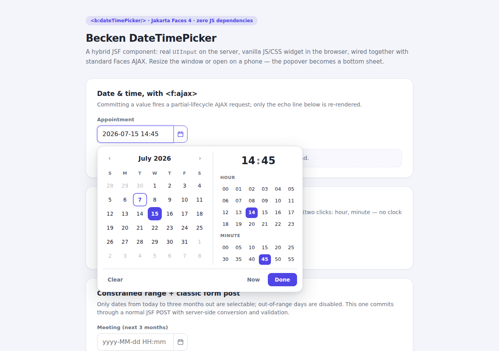

# Becken DateTimePicker — a hybrid JSF component

A datetime picker that is a **real JSF component "at heart"** (Jakarta Faces 4 / EE 10) with a
dependency-free JavaScript/CSS widget layer. No jQuery, no React, no PrimeFaces — ~1000 lines total.

```xhtml
xmlns:b="https://becken.dev/faces"

<b:dateTimePicker value="#{bean.appointment}">
    <f:ajax event="valueChange" listener="#{bean.onChange}" render="echo"/>
</b:dateTimePicker>
```



More: [mobile bottom sheet](docs/screenshot-mobile.png) · [dark mode](docs/screenshot-dark.png)

## Modules

| Module | What it is |
|---|---|
| `datetime-picker` | The reusable component jar: `UIInput` subclass + `Renderer` + taglib + JS/CSS shipped as Faces resources |
| `demo` | A small showcase webapp (TomEE) exercising every feature |

## Run the demo

```bash
mvn install
mvn -pl demo tomee:run     # then open http://localhost:8080/
```

## Design: why it looks the way it does

The goal was *fewest clicks, no wheels, no clock dial*:

- **Date**: a classic month grid — one click. The title is a quick-jump: click it once for a
  12-month grid, twice for a 12-year grid, so any date in any decade is ≤ 4 clicks away.
- **Time**: two flat grids — 24 hour cells and minute cells at a configurable step
  (`minuteStep`, default 5). Picking a time is exactly **two clicks**; no dragging a clock hand,
  no scrolling wheels. Odd minutes can be typed in the big `HH:mm` segments at the top.
- **Typing always works**: the field itself is a lenient free-text input
  (`2026-12-25 18:00`, `25/12/2026`, separators don't matter — the pattern defines the order).
- **Responsive** ("adaptive layout"): a side-by-side popover on desktop/tablet becomes a
  bottom sheet with a backdrop and sticky action bar under 600 px.
- **Dark mode** follows `prefers-color-scheme`; all colors are CSS custom properties
  (`--bdtp-accent`, …) so theming is one CSS rule.
- **Locale-aware**: month/weekday names and the first day of the week come from the *server-side
  view locale* (`java.time` display names), not from the browser.
- `Now`, `Clear`, `Done`, `Esc` to cancel, arrow-key navigation in the day grid.

### Tag attributes

`value` (LocalDateTime/LocalDate/LocalTime), `mode` (`datetime`|`date`|`time`), `pattern`
(`yyyy MM dd HH mm` tokens), `minuteStep`, `min`/`max` (ISO strings or java.time values),
`placeholder`, `required`, `disabled`, `label`, `styleClass`.

## Architecture: how the hybrid works

This answers the questions that motivated the project.

### Does JSF have *true* AJAX? Yes — since JSF 2.0 (2009)

JSF's AJAX is real XHR-based partial processing, standardized in the spec:

1. `<f:ajax>` (or PrimeFaces `<p:ajax>`) attaches a **ClientBehavior** to a component.
2. On the client it calls the standard JS API — `faces.ajax.request(source, event, {execute, render})`
   (called `jsf.ajax.request` before Faces 4.0) from the spec-defined `faces.js` resource.
3. The server runs the **full six-phase lifecycle**, but only for the components named in
   `execute`, and renders only the components named in `render` (partial view rendering).
4. The response is a small XML "partial response"; `faces.js` swaps the affected DOM subtrees
   and re-executes embedded scripts.

So the lifecycle you remembered is exactly what runs — just scoped to a subtree instead of the
whole page. And yes, you can call `faces.ajax.request(...)` **directly from your own JS**, which
is precisely how hybrid components integrate seamlessly.

### How this component uses it

The renderer emits three cooperating pieces:

```
<div id="clientId">                          ← component root
  <input type="hidden" name="clientId"       ← canonical ISO value; decoded by the server;
         onchange="faces.ajax.request(...)">    <f:ajax> behaviors are rendered here
  <input type="text">                        ← human-facing, typeable, pattern-formatted
  <button>📅</button>
</div>
<script>BeckenDTP.init("clientId", {...})</script>  ← config incl. server-resolved locale data
```

- The **server** owns state, conversion (`LocalDateTime`/`LocalDate`/`LocalTime`), validation
  (`required`, range), and locale data. Standard `UIInput` decode applies because the hidden
  input is named after the clientId.
- The **JS widget** owns interaction only. When the user commits a value it writes the ISO
  string into the hidden input and dispatches a native `change` event — which fires whatever
  Faces behavior script the server rendered there. One line of glue; the rest is standard JSF.
- After an AJAX update replaces the component's DOM, the inline init script re-runs
  automatically (`faces.js` executes scripts in updated markup), so the widget re-binds itself.
  Document-level listeners detect a disconnected root and self-remove.

This is the same pattern PrimeFaces uses internally (server renderer + JS widget + behavior
system) — just without the jQuery runtime.

### Is integrating JSF with Web Components / React / Vue possible? Advantageous?

Possible: yes, all three. Advantageous: usually only Web Components.

- **Web Components** fit JSF naturally: a renderer can emit `<my-element value="...">` plus a
  hidden input, and a custom element is framework-agnostic, self-initializing (no re-init glue
  after AJAX swaps, since `connectedCallback` fires when faces.js inserts it), and owns its
  internals via shadow DOM. If this picker grew significantly, promoting the widget layer to a
  custom element would be the natural next step.
- **React/Vue islands** inside JSF pages work (render a `<div>`, mount the app, tear it down on
  AJAX updates) but you now run **two component trees with two lifecycles** that both want to
  own the DOM: every `render=` update that touches the island must unmount/remount it, state
  must be mirrored through hidden inputs, and you ship a second framework runtime. Worth it only
  for a genuinely complex embedded app (an editor, a dashboard), not for form controls.
- For form-level widgets, the sweet spot is exactly this hybrid: **JSF owns data and lifecycle,
  vanilla JS (or a custom element) owns interaction.**

## What the demo shows

- `datetime` mode with `<f:ajax>` partial update (echo line re-renders, page doesn't reload)
- `date` mode (single click commits & closes) with a custom `dd/MM/yyyy` pattern
- `time` mode (hour + minute = two clicks, auto-commit) with `minuteStep="15"`
- `min`/`max` range with disabled out-of-range days + `required` validation via classic POST
- Bottom-sheet layout on a phone-sized viewport, dark mode via OS preference
