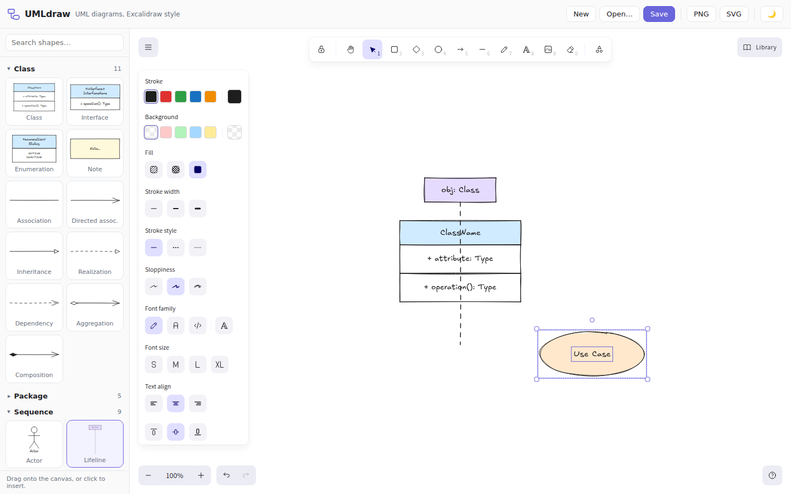

# UMLdraw

A free, modern UML diagram builder for the browser — an "Excalidraw version of
a UML builder". It embeds the MIT-licensed
[Excalidraw](https://github.com/excalidraw/excalidraw) editor and adds a UML
stencil palette on top, so you get a hand-drawn-style infinite canvas with
full editing (move, resize, connect, label) plus ready-made UML shapes.

See [docs/RESEARCH.md](docs/RESEARCH.md) for the research and analysis of
existing UML tools and libraries that led to this design.



## Features

- **6 diagram types** in the palette: Class, Package, Sequence, Activity,
  State, Use Case (~50 stencils: class boxes with compartments, interfaces,
  all UML relationship arrows, lifelines, activations, messages, fragments,
  activity/state nodes, actors, use cases, «include»/«extend», …) plus a
  Common group (notes, text, title frame)
- **Multiple diagrams as tabs** — add, switch, close, and rename
  (double-click a tab); every tab autosaves independently
- **Starter templates** — "New" opens a template picker with a worked example
  for each of the 6 diagram types (arrows come pre-bound to shapes, so they
  stay attached when you move things)
- **Drag & drop** stencils onto the canvas, or click to insert at the center
- Everything Excalidraw can do: move, resize, rotate, edit labels
  (double-click), arrows that stay bound to shapes, undo/redo, zoom/pan,
  multi-select, alignment, dark mode
- **Autosave** to `localStorage` — close the browser, come back, all your
  tabs are still there (no server, no database)
- **Save / Open** standard `.excalidraw` files (interoperable with
  excalidraw.com); opening a file adds it as a new tab
- **Export** the current tab to PNG and SVG
- **Text export to Mermaid / PlantUML** — the "Text" button reconstructs a
  best-effort semantic model from the drawing (compartment stacks → classes,
  arrowheads → relationship kinds, bindings/proximity → connections) and
  generates a Mermaid `classDiagram`/`flowchart` or PlantUML source you can
  copy or download (`.mmd`/`.puml`)
- **Text import from Mermaid / PlantUML** — the "Import" button parses
  Mermaid class diagrams and flowcharts or PlantUML class/shape diagrams,
  auto-lays them out (layered top-down, inheritance parents on top), and
  opens the result as a new tab of fully editable shapes with arrows bound
  to the right class compartments; export → import round-trips
- **UML shape library export** — all stencils are preloaded into the
  editor's built-in Library panel, and the "UML lib" button downloads them
  as a standard `.excalidrawlib` file you can load on excalidraw.com or in
  any other Excalidraw instance; shapes you add to the library yourself are
  persisted too
- Fully client-side and offline-capable (fonts are self-hosted); TypeScript +
  React + Vite

## Running it

```bash
npm install
npm run dev        # http://localhost:5173
```

Production build (static files, host anywhere or open via any static server):

```bash
npm run build
npm run preview    # serves dist/ at http://localhost:4173
```

## Smoke test

A headless-Chromium end-to-end test (insert via click and drag & drop,
autosave, PNG export, theme toggle):

```bash
npm run build
npm run preview -- --port 4173 &
npm run smoke      # set CHROMIUM_PATH if Chromium lives elsewhere
```

## Project structure

```
src/
  App.tsx                        app shell: canvas, tabs, insert/save/load/export
  workspace.ts                   multi-document store on top of localStorage
  library.ts                     stencils as an Excalidraw library (.excalidrawlib)
  textExport.ts                  scene -> Mermaid / PlantUML text generator
  textImport.ts                  Mermaid / PlantUML parser + auto layout -> shapes
  components/Palette.tsx         UML stencil sidebar (search, groups, previews)
  components/Toolbar.tsx         top bar (New / Open / Save / PNG / SVG / theme)
  components/Tabs.tsx            diagram tabs (switch, rename, close, add)
  components/TemplateDialog.tsx  "New diagram" template picker
  components/previews.ts         skeleton -> SVG preview renderer (cached)
  stencils/builders.ts           shared shape-builder helpers and colors
  stencils/index.ts              all UML stencil definitions (element skeletons)
  stencils/types.ts              skeleton helpers (bounds, translation)
  templates/index.ts             starter example diagram per diagram type
scripts/
  copy-fonts.mjs                 self-hosts Excalidraw fonts (pre dev/build)
  smoke.mjs                      Playwright smoke test
```

## How stencils work

Each stencil is a list of Excalidraw *element skeletons* (see
`src/stencils/index.ts`). On insert they are converted to real elements with
`convertToExcalidrawElements()` and appended to the scene — from then on they
are ordinary Excalidraw shapes. Adding a new stencil is a ~10-line change.
