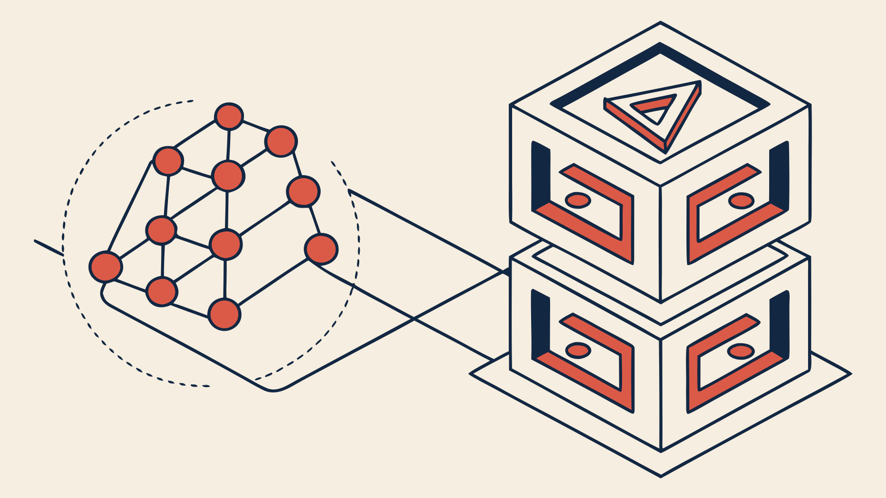

# Deep Learning & Transformers — A First-Principles Guide



A self-contained course that starts from a single artificial neuron and ends
inside a working GPT-2. Every concept is built **from first principles**: no
step is justified by "because that's how it's done" — each piece of the
transformer is derived from things you already understand by the time you
reach it.

The guiding thesis of the whole course:

> **A neural network is a universal function approximator, and a transformer
> is nothing more than a very cleverly wired neural network.** Every box in
> the transformer architecture diagram is made of the same three ingredients
> you already know: matrix multiplications, element-wise nonlinearities, and
> learned parameters trained by gradient descent.

If you keep that sentence in mind, the "strangeness" of the transformer
dissolves chapter by chapter.

## Who this is for

You have seen neural networks before (say, a digit-classification MLP), you
have looked at the transformer architecture diagram, and it felt like a
different species. This course is the bridge.

## The chapters

| # | Chapter | What you build |
|---|---------|----------------|
| 1 | [Neural networks from first principles](part-1-neural-networks.md) | XOR in raw NumPy (backprop by hand), XOR in PyTorch, a digit classifier |
| 2 | [From neurons to transformers — the bridge](part-2-from-neurons-to-transformers.md) | The mental remapping from MLPs to token-stream processors |
| 3 | [Embeddings — how meaning becomes numbers](part-3-embeddings.md) | A tiny embedding layer trained from scratch; watch vectors move during training |
| 4 | [Attention — the heart of the transformer](part-4-attention.md) | Scaled dot-product attention in ~10 lines, then multi-head, then causal masking |
| 5 | [The decoder-only transformer, block by block](part-5-decoder-only-transformer.md) | A complete mini-GPT you train on real text on a laptop CPU |
| 6 | [GPT-2 in practice](part-6-gpt2-in-practice.md) | Load real GPT-2 weights, dissect them, generate text, visualize attention |
| 7 | [Fine-tuning](part-7-fine-tuning.md) | Make GPT-2 Shakespearean three ways: full, frozen-layers, and LoRA from scratch |
| 8 | [The KV cache](part-8-kv-cache.md) | Build the cache, prove it exact, benchmark the speedup, do the memory arithmetic |

Each chapter ends with **exercises** (with hints, not solutions — the
struggle is the point) and a short **historical context** section, because
knowing *why* an idea appeared makes it far easier to remember *what* it is.

## The code

| File | Chapter | Runs on |
|------|---------|---------|
| [`code/01_xor_numpy.py`](code/01_xor_numpy.py) | 1 | any CPU, seconds |
| [`code/02_xor_pytorch.py`](code/02_xor_pytorch.py) | 1 | any CPU, seconds |
| [`code/03_digits_mlp.py`](code/03_digits_mlp.py) | 1 | any CPU, ~1 min |
| [`code/04_embeddings_toy.py`](code/04_embeddings_toy.py) | 3 | any CPU, seconds |
| [`code/05_attention_step_by_step.py`](code/05_attention_step_by_step.py) | 4 | any CPU, seconds |
| [`code/06_mini_gpt.py`](code/06_mini_gpt.py) | 5 | CPU ~10 min / GPU ~1 min |
| [`code/07_gpt2_explore.py`](code/07_gpt2_explore.py) | 6 | CPU, downloads ~500 MB once |
| [`code/08_finetune_gpt2.py`](code/08_finetune_gpt2.py) | 7 | LoRA: CPU ~10 min / full: GPU |
| [`code/09_kv_cache.py`](code/09_kv_cache.py) | 8 | any CPU, ~5 min |

Notebook versions of the same material live in [`notebooks/`](notebooks/) —
they are ready for **Google Colab** (each has an "Open in Colab" badge).

## Setup (local)

```bash
python3 -m venv .venv && source .venv/bin/activate
pip install -r requirements.txt   # torch, numpy, matplotlib, scikit-learn, transformers
```

CPU-only PyTorch is fine for everything here; that is deliberate. On Colab,
everything is pre-installed — just open the notebooks.

## How to study this

1. **Run the code before reading the explanation.** Watching XOR fail to
   converge with a bad seed teaches more than a paragraph about loss
   landscapes.
2. **Do the exercises.** They are small (10–30 minutes each) and each one
   removes one specific piece of "magic".
3. **Draw the shapes.** Whenever a tensor appears, write down its shape.
   90% of transformer confusion is shape confusion.

## Recommended companions

- Andrej Karpathy's [*Neural Networks: Zero to Hero*](https://karpathy.ai/zero-to-hero.html)
  video series and [nanoGPT](https://github.com/karpathy/nanoGPT) — this
  guide is written to give you the foundations to enjoy those fully.
- The original papers, referenced per-chapter in the historical notes —
  above all [*Attention Is All You Need*](https://arxiv.org/abs/1706.03762) (2017).
