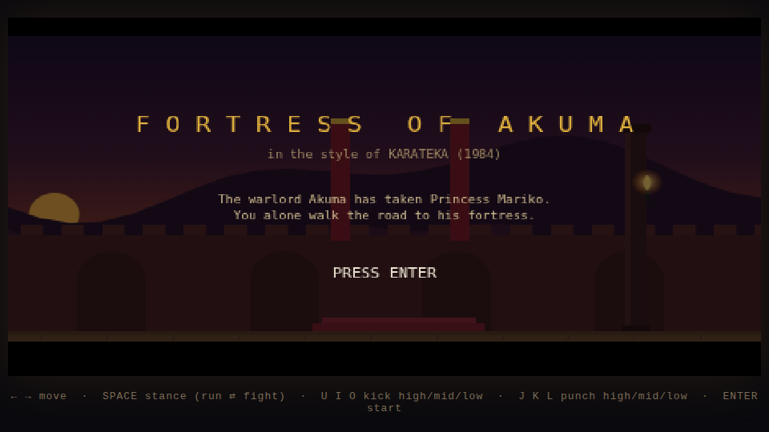
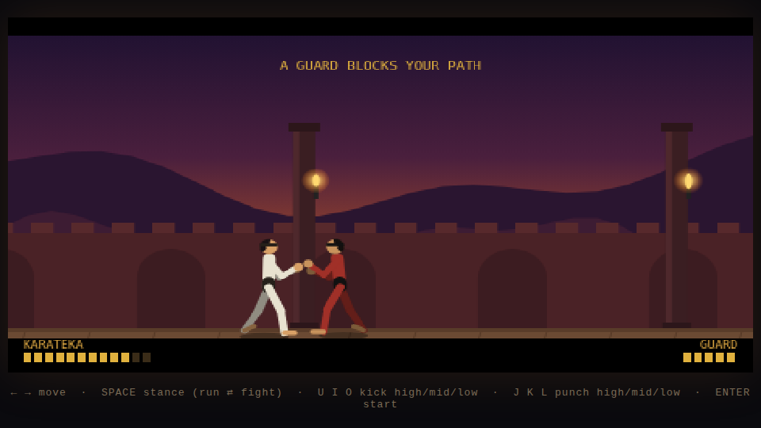

# Fortress of Akuma

A side-scrolling martial-arts game for the browser, built in the style of
**Karateka** (Jordan Mechner, 1984). Walk and run through the warlord Akuma's
fortress, fight his guards one at a time with high/mid/low punches and kicks,
defeat Akuma himself, and rescue Princess Mariko.




## Running it

No build step and no runtime dependencies — it's plain HTML/CSS/JS.

```sh
cd karateka
python3 -m http.server 8321     # or: npm run serve, or any static server
# open http://localhost:8321
```

Opening `index.html` directly from disk also works, since the game uses plain
script tags rather than ES modules.

## Controls

| Key | Action |
| --- | --- |
| ← / → | walk / run (travel stance), shuffle (fighting stance) |
| Space | toggle stance: running ⇄ fighting |
| J / K / L | punch high / mid / low |
| U / I / O | kick high / mid / low |
| Enter | start / restart |

## Rules inherited from the original Karateka

- **Two stances.** You cover ground fast in the running stance, but you can
  only attack — and survive a hit — in the fighting stance. If an enemy
  strikes you while you're in the running stance, you are defeated instantly,
  exactly like the 1984 game.
- **Three heights.** Every punch and kick targets high, mid, or low. If both
  fighters attack at the same height at the same moment, the blows clash and
  cancel; spacing and timing are your real defense.
- **One life.** Defeat means starting the road to the fortress again.
- **Vitality regenerates** slowly while you stand still and rest.
- **The ending Easter egg.** Approach the princess in fighting stance at your
  own peril — in the original, Mariko greets an armed stranger with a kick.
  That behavior is faithfully reproduced.

## Technical aspects

### Procedural 2D skeletal animation (instead of sprite sheets)

The original Karateka got its famously smooth movement from *rotoscoping* —
Mechner filmed his karate teacher with a Super-8 camera and traced the frames.
This project gets a similar fluidity with a different technique: **runtime
skeletal animation with forward kinematics** (`js/rig.js`, `js/animations.js`).

- Each fighter is a small humanoid skeleton (torso, head, two-segment arms and
  legs, feet, fists) posed entirely by **joint angles**. `Rig.solve()` turns a
  pose into joint positions with forward kinematics.
- Animations are **keyframed poses** — e.g. a high kick is only four key
  poses (guard → knee chamber → full extension → re-chamber). The sampler
  interpolates joint angles between keyframes with **smoothstep easing**, so
  motion is generated at the display frame rate rather than at a fixed
  sprite-sheet rate. That per-frame in-betweening is what makes the movement
  read as "rotoscoped" rather than "flipbook".
- **Pose blending:** whenever a character switches animation (walk → punch →
  hit reaction…), the old pose is linearly blended into the new animation over
  120 ms, so there are no pops between states. State transitions never need
  hand-authored transition clips.
- Every animation is authored once, facing right; left-facing characters are
  **mirrored mathematically** (a sign flip on the horizontal component of each
  bone vector).
- Knockdowns reuse the same rig with a whole-body rotation channel (`rot`)
  around the hip, so fighters visibly stagger and fall flat.
- Rendering is canvas vector drawing: limbs are thick round-capped strokes,
  with far-side limbs drawn first and darker for depth. The princess is the
  same rig with a kimono painted over it — and she reuses the combat system
  for the Easter-egg kick.

### 1984 look via low-resolution rendering

The game simulates the era's chunky pixels without sacrificing the smooth
animation: everything is rendered into an offscreen **480×270** canvas, then
scaled ×2 onto the visible canvas with `imageSmoothingEnabled = false`
(plus CSS `image-rendering: pixelated`). Smooth skeletal motion, displayed
through big pixels — the same trick as a modern "hi-bit" retro game. The
letterboxed frame mirrors Karateka's cinematic presentation.

### Scrolling and parallax

The camera eases toward the player (`camX += (target - camX) · 6dt`). The
fortress background is four independently scrolling layers — far mountains
(0.15× camera speed), near hills (0.3×), fortress wall with crenellations and
arches (0.55×), and the playfield floor/columns (1×) — which produces the
depth of a tracking shot as you run. Torches on the columns flicker with
layered sine noise; scenery placement uses a deterministic hash so the world
is stable without storing level data.

### Sound effects synthesized with the Web Audio API

There are **no audio files**. Every effect in `js/audio.js` is synthesized at
trigger time from oscillators and filtered white noise:

- *whoosh* — band-pass-filtered noise with an upward frequency sweep
- *hit / hurt* — a pitch-dropping sine "thud" plus a noise slap
- *clash* — a high-Q metallic noise click when same-height attacks cancel
- *footsteps* — short low noise ticks, triggered by the walk/run animation
  cycle itself (sound is keyed to keyframe phase, so steps always land on the
  frame where a foot plants)
- *knockout* — descending sawtooth plus a delayed body-fall thump
- *gong* — stacked inharmonic sine partials announcing each opponent
- *fanfare* — a small pentatonic square-wave melody for the rescue
- *heartbeat* — low sine pulses that start when vitality is critical

### Game architecture

Plain JavaScript, no frameworks, ~1,300 lines across eight files loaded with
ordinary script tags (so it runs from `file://` too):

| File | Responsibility |
| --- | --- |
| `js/rig.js` | skeleton definition, forward kinematics, character painter |
| `js/animations.js` | keyframe data + sampler (easing, looping, blending) |
| `js/fighter.js` | character state machine (idle/move/attack/hit/block/KO), attack hit-windows, movement, vitality |
| `js/ai.js` | opponent behaviour: close distance, probe attacks, step-backs; per-guard aggression profiles |
| `js/level.js` | parallax fortress, floor, torches, princess chamber |
| `js/audio.js` | Web Audio synthesis of all sound effects |
| `js/input.js` | keyboard state with per-frame edge detection |
| `js/game.js` | main loop, game states, camera, combat resolution, HUD |

Combat resolution is *positional*, like the original: an attack only lands if
the striking limb's actual fingertip/toe position — taken from the solved
skeleton on that exact frame — reaches the opponent's body during the
attack's active window. Reach therefore emerges from the animation itself
rather than from a hitbox table. Player and enemies share the same `Fighter`
class and the same attacks; enemies differ only in colors, vitality, damage
multiplier, and AI aggression profile.

### Automated testing

`test/smoke.mjs` drives the real game in headless Chromium via Playwright:
it plays through a fight with synthesized keystrokes and asserts that a guard
can be knocked out, that the path opens afterwards, that the
running-stance-instant-defeat rule and the game-over flow work, and that both
princess endings (rescue and Easter-egg kick) trigger — with zero JavaScript
errors.

```sh
npm install          # installs playwright-core (dev only)
npm run serve &      # static server on :8321
npm test
```

## Credits

Inspired by *Karateka* (1984) by Jordan Mechner. This is an original homage —
all code, art, and audio are generated procedurally; no assets from the
original game are used.
