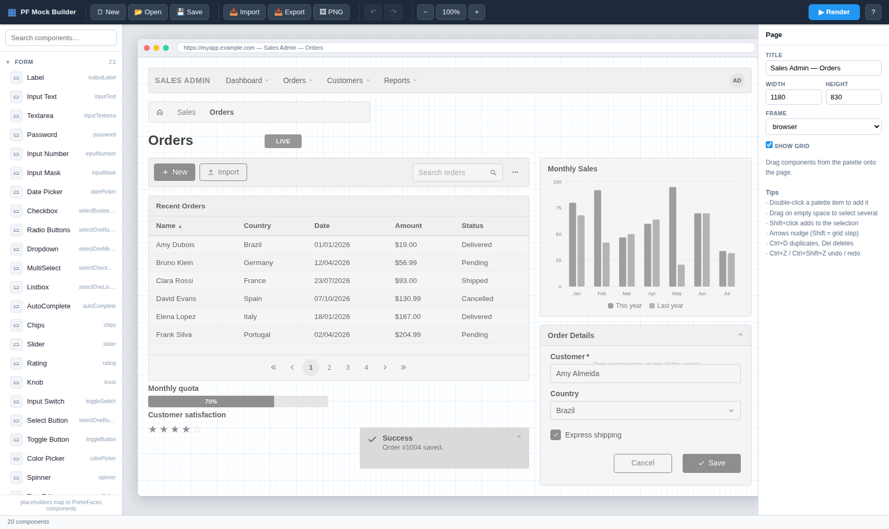
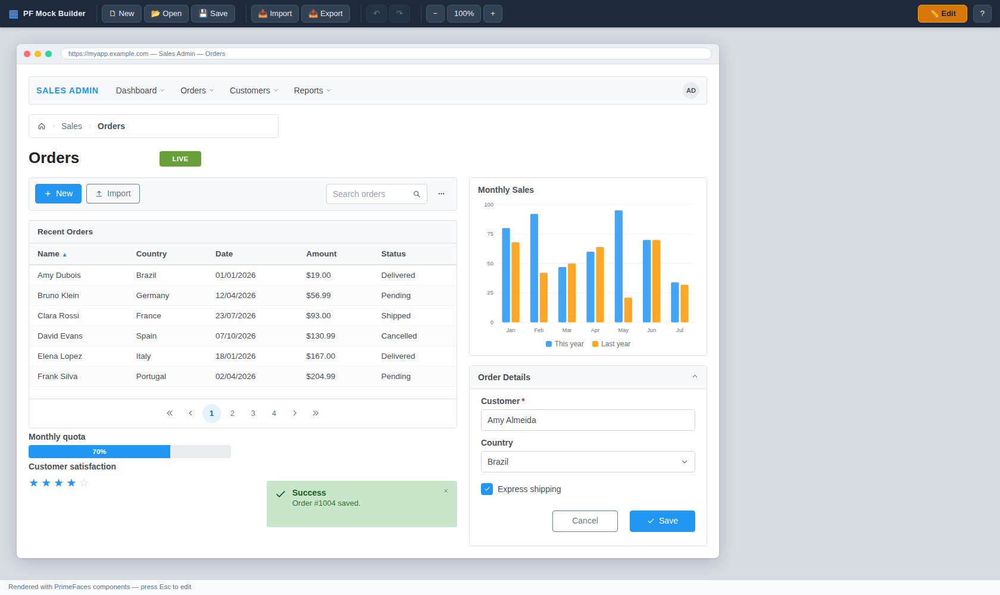

# PF Mock Builder

A fast, browser-local UI mock layout builder in the spirit of **Balsamiq** / **Figma**, purpose-built for **PrimeFaces** UIs.

Sketch a screen by dragging placeholder components from a palette onto a page, arrange them freely, then press **▶ Render** to see the exact same layout drawn as realistic **PrimeFaces** components (Saga theme look) filled with generated mock data. Save layouts as portable JSON "recipes" and load them later to continue.

No build step, no server, no dependencies — **just open `index.html` in a browser.**

| Edit (wireframe) | ▶ Render (PrimeFaces look) |
|---|---|
|  |  |

## Features

- **Containers** — drop a component onto a Panel, Card, Fieldset, TabView, Dialog, Sidebar or OverlayPanel and it nests inside: moving the container moves its contents, delete/duplicate cascade, and the inspector shows the membership with a **Detach** action. The target container highlights green while dragging.
- **PNG export** — the 🖼 PNG button rasterizes the layout (current mode: rendered or wireframe) at 2× resolution, fully offline.
- **Component palette** — 55+ placeholder types, each mapped to a PrimeFaces component (the `p:` tag is shown in the palette and inspector). Categorized (Form, Buttons, Data, Panels, Overlays, Menus, Messages, File & Media, Misc) and searchable.
- **Drag & drop canvas** — drag from the palette (or double-click to add), move freely with 10px grid snapping, resize with 8 handles, marquee/Shift multi-select, align tools, z-order controls, duplicate, keyboard nudging.
- **Wireframe ⇄ Render** — while editing, components appear as grayscale wireframes (Balsamiq-style low fidelity). **▶ Render** switches the same layout to full-color PrimeFaces-styled components. Because both modes share the same markup, the render always matches the sketch pixel-for-pixel.
- **Mock data** — tables, lists, charts, trees, timelines etc. are filled with deterministic generated data (names, countries, prices, dates…). DataTable columns are smart: name a column `Email`, `Price`, `Status`, `Date`… and it generates matching values.
- **Save / load recipes** —
  - **Save/Open**: named layouts in browser `localStorage`
  - **Export/Import**: portable `*.mock.json` files
  - **Autosave**: every change is autosaved; reopening the page restores your work
- **Editing comfort** — undo/redo (100 steps), page frame chrome (browser / window / none), configurable page size, collapsible palette (« / » to give the page more room), demo layout on first run, help dialog with all shortcuts.
- **Zoom** — Ctrl/Cmd + mouse wheel over the page (anchored at the pointer), − / + buttons, ⛶ fit-to-view, click the % to reset. Zoom-out is capped exactly at the level where the whole page fits the work area, so you can always see the entire mock without scrollbars.

## Rendered components (palette → PrimeFaces mapping)

| Category | Components |
|---|---|
| Form | Label, InputText, Textarea, Password, InputNumber, InputMask, DatePicker, Checkbox, Radio group, Dropdown (SelectOneMenu), MultiSelect, Listbox, AutoComplete, Chips, Slider, Rating, Knob, InputSwitch, SelectButton, ToggleButton, ColorPicker, Spinner, Text Editor |
| Buttons | CommandButton (severities / outlined / text / rounded / icons), SplitButton, Link |
| Data | DataTable, TreeTable, DataView, Tree, OrderList, PickList, Carousel, Timeline, Paginator, Chart (bar / hbar / line / area / pie / doughnut / radar), Galleria |
| Panels | Panel, Card, Fieldset, Accordion, TabView, Toolbar, Divider |
| Overlays | Dialog, ConfirmDialog, OverlayPanel, Sidebar, Tooltip |
| Menus | Menubar, Menu, PanelMenu, Breadcrumb, Steps, TabMenu |
| Messages | Message, Messages, Toast/Growl |
| File & Media | FileUpload, Image, Avatar |
| Misc | Heading, Paragraph, ProgressBar, Badge, Tag, Chip, Skeleton |

> Note: components are **static lookalikes** of PrimeFaces (no behavior, by design). Rendering real `p:` components would require a JSF server; this app reproduces their markup and Saga-theme styling in pure HTML/CSS so it stays 100% local.

## Shortcuts

| Action | Keys |
|---|---|
| Add component | drag from palette, or double-click it |
| Select | click · Shift+click add · drag empty space (marquee) · Ctrl/Cmd+A |
| Move | drag · arrows (1px) · Shift+arrows (10px) |
| Duplicate / Delete | Ctrl/Cmd+D · Del |
| Undo / Redo | Ctrl/Cmd+Z · Ctrl/Cmd+Shift+Z |
| Zoom | Ctrl/Cmd+wheel · − / + · ⛶ fit page · click % to reset |
| Save to browser | Ctrl/Cmd+S |
| Render ⇄ Edit | ▶ Render button · Esc |

## Layout recipe format

```json
{
  "app": "pf-mock-layout",
  "version": 1,
  "canvas": { "title": "My Application", "width": 1180, "height": 830, "chrome": "browser", "grid": true },
  "components": [
    { "id": "c1", "type": "dataTable", "x": 20, "y": 260, "w": 720, "h": 350,
      "props": { "columns": "Name\nCountry\nStatus", "rows": 6, "paginator": true } }
  ]
}
```

`type` is the registry key (see `js/components.js`), `props` holds only the values that differ from defaults.

## Project structure

```
mock-ui-builder/
├── index.html          app shell (toolbar, palette, canvas, inspector)
├── css/
│   ├── app.css         builder chrome + wireframe treatment
│   └── prime.css       PrimeFaces Saga-look theme for rendered components
└── js/
    ├── mockdata.js     deterministic mock data generator
    ├── components.js   component registry: palette → PrimeFaces mapping + renderers
    ├── sample.js       demo layout (loaded on first run)
    └── app.js          canvas interactions, undo/redo, save/load, render mode
```

## Extending the palette

Add a `def('myType', {...})` entry in `js/components.js` with a name, the PrimeFaces tag, a category, a default size, a prop schema, and an `html(props)` renderer, then style any new classes in `css/prime.css`. It immediately appears in the palette, inspector, and save format.

**See [docs/GUIDE.md](docs/GUIDE.md)** for the full architecture explanation (including how the PrimeFaces look is achieved without a JSF server) and a step-by-step worked example of adding a new component.
