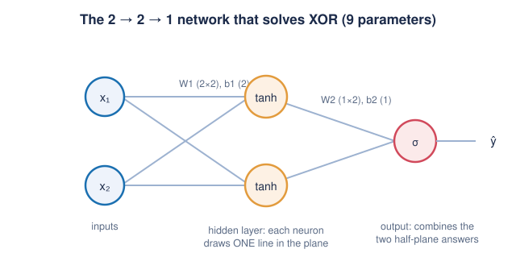

# Part 1 — Neural Networks From First Principles

> **Goal of this chapter.** Rebuild your intuition for neural networks so
> solidly that Part 2's claim — *"a transformer is just a rewired neural
> network"* — will feel obvious rather than mysterious. We go: function →
> neuron → layer → nonlinearity → universal approximation → loss → gradient
> descent → backpropagation → working code (XOR, then digits).

---

## 1.1 Everything is a function

Strip away the biology-flavored vocabulary and a neural network is one thing:

> **A function with tunable knobs.**

A function `f` maps an input to an output: `y = f(x)`. Classical programming
means *you* write `f` by hand. Machine learning means you write a **family**
of functions `f(x; θ)` — where `θ` ("theta") is a big bag of numbers called
**parameters** or **weights** — and you let an algorithm *search for the θ*
that makes the function behave as desired on examples.

That's it. That is the entire field, philosophically:

| | Classical programming | Machine learning |
|---|---|---|
| You provide | rules (code) | examples (data) + a function *family* |
| Machine produces | outputs | the rules (the parameter values θ) |

Your old digit-recognizer was a function from a 28×28 image (784 numbers) to
9 or 10 scores. XOR is a function from 2 bits to 1 bit. GPT is a function
from a sequence of words to a probability distribution over the next word.
**Same concept, different plumbing.** Keep this framing; it is the single
most load-bearing idea in the whole course.

## 1.2 The artificial neuron

The smallest tunable function worth having is a **weighted sum plus a
threshold-ish decision**:

```
z = w₁x₁ + w₂x₂ + ... + wₙxₙ + b        (the "pre-activation": a dot product plus a bias)
a = g(z)                                 (the "activation": a nonlinear squashing)
```

- The **weights** `wᵢ` say how much each input matters (and in which direction).
- The **bias** `b` shifts the decision threshold.
- `g` is a **nonlinear** function — sigmoid `1/(1+e^{-z})`, tanh, or the
  modern default **ReLU**: `g(z) = max(0, z)`.

Geometric picture (worth internalizing): the equation `w·x + b = 0` defines a
**hyperplane** — a line in 2D, a plane in 3D. A single neuron answers exactly
one question: *"which side of my hyperplane is the input on, and how far?"*
The nonlinearity `g` then reshapes that signed distance into a useful signal.

A single neuron is therefore a **linear classifier**. It can separate points
with one straight cut. Which brings us to the most famous failure in the
history of AI.

### The XOR problem — why one neuron is not enough

XOR (exclusive-or) outputs 1 when its two inputs *differ*:

| x₁ | x₂ | XOR |
|----|----|-----|
| 0  | 0  | 0   |
| 0  | 1  | 1   |
| 1  | 0  | 1   |
| 1  | 1  | 0   |

Plot the four points on a plane: the two "1" points, (0,1) and (1,0), sit on
one diagonal; the two "0" points, (0,0) and (1,1), on the other. **No single
straight line separates them.** Try it on paper — this is Exercise 1.1, and
it takes two minutes that pay off for years.

The fix: **stack neurons in layers**. A first layer of two neurons draws
*two* lines; a second layer combines the answers ("above line A AND below
line B"). Composition of simple decisions yields complex decisions. That is
the "deep" in deep learning.

> **Historical note.** The artificial neuron dates to McCulloch & Pitts
> (1943); the trainable **perceptron** to Frank Rosenblatt (1958), a
> room-sized machine the New York Times said would soon "walk, talk, see,
> write". In 1969 Minsky & Papert's book *Perceptrons* proved single-layer
> perceptrons cannot compute XOR — a correct theorem widely (over-)read as
> "neural nets are a dead end", helping trigger the first **AI winter**.
> The escape hatch — multi-layer networks trained by backpropagation — was
> popularized by Rumelhart, Hinton & Williams in 1986. Your first program in
> this course solves, in ~60 lines and a few seconds, the exact problem that
> froze the field for 15 years.

## 1.3 Layers: neurons vectorized

Nobody computes neurons one at a time. A **layer** of `m` neurons over `n`
inputs is a matrix multiply:

```
z = W x + b        W has shape (m, n) — one row per neuron
a = g(z)           g applied element-wise
```

A **multi-layer perceptron (MLP)** — also "feed-forward network" — is just
composition:

```
h₁ = g(W₁ x  + b₁)
h₂ = g(W₂ h₁ + b₂)
ŷ  =    W₃ h₂ + b₃          (output layer often has no g, or a task-specific one)
```

Two consequences you should tattoo somewhere:

1. **A neural network is nothing but alternating matrix multiplications and
   element-wise nonlinearities.** When you meet the transformer, every
   sub-block will reduce to exactly this. There is no other ingredient.
2. **Without the nonlinearity, depth is pointless.** Compose two linear maps
   and you get a linear map: `W₂(W₁x) = (W₂W₁)x`. A 100-layer purely-linear
   network collapses into a single matrix. The humble `max(0, z)` is what
   makes depth *mean* something.

### Shapes discipline

The habit that will save you in Part 4: **annotate every tensor with its
shape.** For a batch of `B` inputs of dimension `n`, through a hidden layer
of size `m`:

```
x  : (B, n)
W₁ᵀ: (n, m)      →   h = x @ W₁ᵀ + b₁ : (B, m)
```

PyTorch's `nn.Linear(n, m)` stores `W` as `(m, n)` and computes `x @ Wᵀ + b`.
When a shape error appears — and it will — it is telling you your mental
model is wrong somewhere. Treasure shape errors.

## 1.4 The universal function approximator

Now the big theorem, and the reason for this course's thesis.

> **Universal Approximation Theorem** (Cybenko 1989; Hornik 1991). A
> feed-forward network with **one hidden layer** and enough neurons can
> approximate *any* continuous function on a bounded region to *any* desired
> accuracy.

Intuition for why (no proof needed, the picture suffices): each hidden
neuron with a sigmoid/ReLU contributes one "step" or "hinge" at a position
and orientation determined by its weights. With enough steps you can
assemble any curve, the way enough LEGO bricks assemble any shape — a
learned, adaptive version of approximating a curve with tiny line segments.

Three crucial fine-prints, because the theorem is often over-quoted:

1. **Existence ≠ learnability.** The theorem says good weights *exist*; it
   says nothing about whether gradient descent will *find* them, how much
   data you need, or how the network behaves outside its training region.
2. **"Enough neurons" can be astronomically many.** A shallow-but-wide
   network may need exponentially more neurons than a deep one for the same
   function. Depth buys *reuse*: early layers build parts (edges), later
   layers compose them (shapes, digits). That hierarchy is why "deep"
   learning won.
3. **The theorem is a license, not a design.** It licenses the mindset:
   *"I need some function mapping X to Y; I don't know its formula; I'll let
   a network become it."* Digit-recognition: an unknown function from pixels
   to digit identity. Language modeling: an unknown function from
   text-so-far to next-word probabilities. GPT is what happens when you take
   the theorem seriously at the scale of all human text — the architecture
   (Parts 3–5) is "merely" plumbing that makes the approximation *findable
   and efficient* for sequences.

## 1.5 Training I: the loss function

To search for good θ we need a single number that measures how wrong the
network currently is: the **loss** `L(θ)`, averaged over training examples.

- **Regression / continuous targets → Mean Squared Error:**
  `L = mean((ŷ - y)²)`. Simple, and its gradient `2(ŷ - y)` literally reads
  "push proportionally to the error".
- **Classification → Cross-Entropy.** The network outputs one raw score
  ("**logit**") per class; **softmax** turns scores into probabilities:

  ```
  p_i = e^{z_i} / Σ_j e^{z_j}
  ```

  and the loss is `-log p_correct`: *the negative log of the probability the
  model assigned to the right answer.* Confidently wrong → `p_correct → 0` →
  loss explodes; confidently right → loss → 0. Remember `-log p`: the exact
  same loss trains GPT (Part 5), where the "classes" are the ~50,000 tokens
  of the vocabulary.

Training is now an optimization problem: **find θ minimizing L(θ)**.

## 1.6 Training II: gradient descent

`L(θ)` is a surface over parameter space — for GPT-2, a surface in 124
million dimensions. We can't visualize it, but calculus hands us a compass:
the **gradient** `∇L(θ)` points in the direction of steepest *increase* of
the loss. So, repeatedly, take a small step the other way:

```
θ ← θ - η · ∇L(θ)
```

`η` (eta) is the **learning rate**, the most temperamental knob in deep
learning: too large diverges, too small crawls. In practice we use
**stochastic** gradient descent (SGD) — estimate the gradient on a small
random **batch** rather than the full dataset — and usually the **Adam**
optimizer (Kingma & Ba, 2014), which keeps per-parameter running averages of
gradients and their squares to auto-tune effective step sizes. Every model
in this course trains with SGD or Adam; GPT-2 trained with Adam too. **The
training algorithm does not change as we go from XOR to GPT.** Let that
sink in: what you learn in this chapter is, unchanged, how frontier models
are trained.

## 1.7 Training III: backpropagation, demystified

One question remains: how do we *compute* `∇L` — the derivative of the loss
with respect to **every** weight, efficiently?

Answer: the **chain rule**, applied systematically back-to-front.
Backpropagation is nothing more exotic than that.

A network is a pipeline: `x → z₁ → h₁ → z₂ → ŷ → L`. The chain rule says the
sensitivity of `L` to something early in the pipe is the *product of local
sensitivities* along the way:

```
∂L/∂W₁ = ∂L/∂ŷ · ∂ŷ/∂z₂ · ∂z₂/∂h₁ · ∂h₁/∂z₁ · ∂z₁/∂W₁
```

Two observations turn this from "calculus homework" into "the algorithm that
powers the field":

1. **Every local derivative is trivial.** Each pipeline stage is either a
   matrix multiply (derivative: the matrix) or an element-wise nonlinearity
   (derivative: e.g. for ReLU, literally 1 where the input was positive, 0
   elsewhere). No stage is hard; there are just many stages.
2. **Work backwards and reuse.** Compute `∂L/∂ŷ` once; every weight in the
   last layer reuses it; then compute the gradient at the layer below from
   the layer above, and so on down. One backward sweep computes *all*
   millions of gradients for roughly the cost of one forward pass. Computed
   naively (one weight at a time), training GPT-2 would take longer than the
   age of the universe; with backprop it took weeks.

**Autograd.** PyTorch records every operation you perform on tensors into a
graph, and `loss.backward()` runs this backward sweep for you. That is all
the "magic" there is — in `01_xor_numpy.py` you will do the sweep by hand
once, precisely so that `loss.backward()` never feels magical again.

> **Historical note.** The chain-rule-on-graphs idea has multiple
> independent inventors (Linnainmaa 1970 as "reverse-mode automatic
> differentiation"; Werbos 1974 for neural nets), but the 1986 Rumelhart,
> Hinton & Williams *Nature* paper made it the standard. The same Hinton
> shared the 2018 Turing Award (with LeCun and Bengio) and the 2024 Nobel
> Prize in Physics for this line of work.

## 1.8 The code

Three programs, in order. Run each, then read it top to bottom.

### `code/01_xor_numpy.py` — XOR with backprop by hand

No frameworks. A 2→2→1 network (the smallest that can solve XOR: 9
parameters), forward pass and every gradient written out with `numpy`. This
file *is* sections 1.2–1.7 made executable. Watch the loss fall from ~0.25
to ~0.001 and print the four predictions.

Architecture (this is the "2×2 net" — 2 inputs, 2 hidden neurons, 1 output):



### `code/02_xor_pytorch.py` — the same, in PyTorch

The identical network in ~25 lines: `nn.Linear(2,2) → Tanh → nn.Linear(2,1)
→ Sigmoid`. Every line of the numpy version maps onto a line here —
`loss.backward()` replaces your hand-written gradient block, and
`optimizer.step()` replaces your update loop. The script also prints the
learned weights so you can *see* the two hyperplanes the hidden layer chose,
and saves a decision-boundary plot to `diagrams/xor-decision-boundary.png`.

### `code/03_digits_mlp.py` — your digit recognizer, revisited

A 64→64→10 MLP on scikit-learn's 8×8 digits (small cousin of MNIST, ~1.8k
images, no big download). This is the network you built years ago — now you
can name every part: cross-entropy (§1.5), Adam (§1.6), autograd (§1.7),
and a proper train/test split. ~97% test accuracy in under a minute on CPU.

One habit to note in all three scripts: the **training loop** is always the
same five lines —

```python
for batch in data:
    optimizer.zero_grad()        # clear old gradients
    loss = criterion(model(x), y)  # forward
    loss.backward()              # backward (backprop)
    optimizer.step()             # θ ← θ - η·∇L
```

You will write this loop for the rest of your life. GPT training is this
loop.

## 1.9 Exercises

**1.1 (paper)** Draw the four XOR points. Convince yourself no line
separates them. Then draw *two* lines that jointly do, and write the boolean
combination ("above A and below B") — you have hand-designed the hidden
layer.

**1.2** In `01_xor_numpy.py`, change the random seed a few times. Sometimes
training gets stuck at loss ≈ 0.25 (predicting 0.5 for everything). Explain
what that plateau *is*, and why re-rolling the initial weights escapes it.
*Hint: what does the loss surface look like there — and is it a property of
the function family or of the search?*

**1.3** In `02_xor_pytorch.py`, replace `Tanh` with `Identity` (i.e., remove
the nonlinearity). Re-run. What happens, and which paragraph of §1.3 did you
just verify experimentally?

**1.4** Solve XOR with hidden width 3, then width 8. Compare convergence
speed and reliability across seeds. Moral: minimal capacity (width 2) is
*sufficient* but fragile — over-parameterization makes optimization *easier*.
This foreshadows why GPT-class models are so large.

**1.5** In `03_digits_mlp.py`, remove the hidden layer entirely
(`nn.Linear(64, 10)` only). Accuracy drops only a little — why is this task
"almost linearly separable" when XOR wasn't? *Hint: 64 dimensions leave much
more room for a hyperplane than 2.*

**1.6 (stretch)** Add a second hidden layer to the digits MLP and train with
learning rates 1.0, 0.1, 0.01, 0.001. Plot the four loss curves. You now
have personal experience with the learning-rate cliff, the sweet spot, and
the crawl.

## 1.10 Where we are

You can now (re-)build, train, and debug feed-forward networks, and you know
*why* every piece exists. Everything that follows — embeddings, attention,
GPT — will be assembled from exactly these parts: `Linear`, a nonlinearity,
softmax, cross-entropy, Adam, backprop. On to the bridge.

→ [Part 2 — From neurons to transformers](part-2-from-neurons-to-transformers.md)
