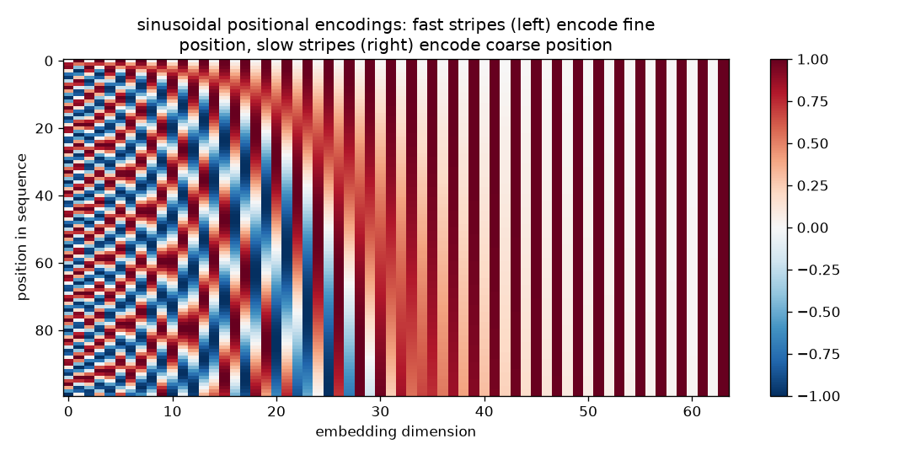

# Part 3 — Embeddings: How Meaning Becomes Numbers (and How They Are *Learned*)

> **Goal of this chapter.** Answer, completely, the question you flagged as
> your main point of confusion: *how are embedding layers learned during
> training?* Short version, up front: **an embedding matrix is an ordinary
> weight matrix — the same kind as your MLP's `W` — and it is learned in
> exactly the same way: gradients flow into it from the loss via backprop.
> The only novelty is that each input uses just one row of it at a time.**
> The rest of the chapter earns that sentence in detail, then covers
> positional embeddings.

---

## 3.1 First: tokens

Networks eat numbers, not text. Step zero of any language model is a
**tokenizer**: a fixed (non-learned, built before training) procedure that
chops text into pieces from a finite **vocabulary** and maps each piece to
an integer ID.

GPT-2 uses **Byte-Pair Encoding (BPE)**: start from raw bytes, repeatedly
merge the most frequent adjacent pair, until you have ~50,257 vocabulary
entries. Result: common words are single tokens (` the` → one ID), rare
words split into chunks (`transformers` → `transform` + `ers`). BPE is a
compression trick, not a neural network — it is learned from corpus
statistics *before* training and then frozen. From here on, "the input" means
a sequence of integer IDs, e.g. `[464, 3797, 3332]`.

> **Why not one ID per character?** Sequences get very long (expensive —
> attention cost grows with length²). **Why not one per word?** Vocabulary
> explodes and unseen words break. Subword units are the compromise.

## 3.2 The problem with integers, and the one-hot detour

Can we feed token ID `3797` into a network as the number 3797.0? No — that
would impose a lie: that token 3798 is "close to" 3797, that token 100 is
"less than" token 200. IDs are *names*, not quantities; arithmetic on names
is meaningless.

The honest-but-naive encoding is a **one-hot vector**: a vector of length
`V` (vocabulary size, ~50k) that is all zeros except a 1 at position 3797.
No false geometry — but every token is now equally distant from every other
token ("cat" is as far from "kitten" as from "carburetor"), and the vectors
are absurdly long and empty.

## 3.3 The embedding layer — a linear layer in disguise

Here is the key derivation. Do it slowly once; embeddings are demystified
forever after.

Take the one-hot vector `x` (length `V`) and do the most standard thing in
this course: multiply it by a weight matrix. Let `E` have shape `(V, d)`
with, say, `d = 768`:

```
e = xᵀ E        →  shape (d,)
```

But `x` is all zeros except a 1 at position `i` — so this matrix multiply
just **selects row `i` of `E`**. All other rows are multiplied by zero.

> **An embedding layer is exactly `Linear(V, d)` (no bias) applied to a
> one-hot input.** And since multiplying by one-hots equals row-selection,
> we *implement* it as a lookup table: `e = E[i]`. PyTorch's `nn.Embedding`
> is precisely this: a `(V, d)` matrix of ordinary learnable parameters plus
> fancy indexing. Nothing else.

Each token in the vocabulary therefore *owns* a `d`-dimensional vector — its
row in `E` — and that vector is the token's representation, its coordinates
in a `d`-dimensional "meaning space".

## 3.4 How embeddings are learned — the complete story

Now your actual question. At initialization, `E` is **random noise** — row
3797 ("cat") is a random 768-dim vector, meaning nothing. Where does meaning
come from? Follow one training step end-to-end:

**Step 1 — Forward.** Batch contains "the cat sat". IDs `[464, 3797, 3332]`.
The model looks up rows `E[464], E[3797], E[3332]`, and these vectors flow
through attention and MLPs to produce a prediction for each next token.

**Step 2 — Loss.** Say after "the cat" the model must predict "sat", and it
assigned "sat" probability 0.001. Cross-entropy loss `-log(0.001)` is large.

**Step 3 — Backward.** Backprop (Part 1, §1.7 — the same chain rule)
computes `∂L/∂θ` for *every* parameter in the model. The embedding matrix
`E` is a parameter like any other, so backprop reaches it too. And because
the forward pass only *read* rows 464, 3797, 3332, **only those rows receive
a nonzero gradient this step** — the chain rule through "multiply by
one-hot" zeroes out every other row. (This "sparse gradient" is the only
operational difference from a dense `Linear` layer.)

**Step 4 — Update.** `E[3797] ← E[3797] - η · ∂L/∂E[3797]`. The "cat" row
moves a tiny bit — in whichever direction makes the observed continuation
("sat") more probable *given everything downstream did with that vector*.

**Step 5 — Repeat, a few trillion times.** Here is where structure emerges,
and the mechanism deserves to be spelled out:

- "cat" and "dog" occur in overlapping contexts ("the ___ slept", "fed the
  ___", "my ___ is cute"). To predict those shared continuations well, the
  downstream network must produce similar outputs when given either vector —
  and the *cheapest* way for gradient descent to arrange that is to make the
  vectors themselves similar. So `E[cat]` and `E[dog]` are pulled toward
  each other, not by any explicit "similarity objective", but as a
  **side-effect of next-token prediction**.
- Tokens used in *different* contexts feel gradients pulling them apart.
- With `d = 768` dimensions to work with, the geometry can encode many
  distinctions at once — famously even directions: after enough training,
  `E[king] - E[man] + E[woman] ≈ E[queen]` (chapter code lets you test the
  analogous thing on a toy scale).

Three common confusions, dispatched:

1. *"Is there a separate embedding-training phase?"* **No.** In GPT-style
   models the embedding matrix trains jointly with everything else, end to
   end, from the single next-token loss. One loss, one optimizer, one
   `backward()`; `E` just happens to be the first parameter the input meets.
   (Pre-2017 pipelines often *did* pre-train standalone word vectors — see
   the history box — which is partly why "how do embeddings get trained?"
   feels like it deserves a special answer. Today: no special answer.)
2. *"How can a lookup have a gradient?"* Because the lookup *is* a matrix
   multiply by a one-hot (§3.3); its backward pass routes the incoming
   gradient to the single selected row. Differentiability was never lost.
3. *"What supervises the embedding?"* The loss — through the whole network.
   The gradient arriving at `E[3797]` encodes "given how attention and the
   MLPs currently use this vector, nudging it *this* way would have lowered
   today's loss". Embeddings and the layers above co-evolve; neither is
   trained "first".

> **Distributional semantics.** The reason this works at all was stated by
> linguist J.R. Firth in 1957: *"You shall know a word by the company it
> keeps."* Next-token prediction forces the model to exploit co-occurrence
> statistics, and the embedding geometry is where those statistics condense.

> **Historical note.** Learned distributed word vectors go back to Bengio's
> neural language model (2003). **word2vec** (Mikolov et al., 2013) made
> them famous: a deliberately tiny network trained to predict nearby words,
> producing vectors with the celebrated king−man+woman≈queen arithmetic.
> GloVe (2014) followed. In that era you *downloaded* pre-trained vectors
> and bolted them onto your model. The transformer era folded this step
> away: embeddings are just the first layer, trained with the rest. It also
> fixed word2vec's core limitation — one static vector per word regardless
> of context ("bank" in "river bank" vs "bank account"). In a transformer,
> the *input* embedding is still static per token, but every layer above
> mixes in context, so by mid-network the "bank" position holds a
> **contextual** representation. Static embedding is the raw material;
> attention contextualizes it.

## 3.5 Positional embeddings — because attention is order-blind

Exercise 2.3 set this trap; here is the spring. Attention (next chapter)
computes token-to-token scores from token *vectors alone*, and the
feed-forward block acts on each position independently. Consequence: if you
shuffle the input tokens, the outputs shuffle identically — the transformer
is, by construction, **permutation-equivariant**. It literally cannot tell
"dog bites man" from "man bites dog". Word order — the thing your MLP got
"for free" because input slot #7 had its own dedicated weights — was traded
away in Shift 2 (weight sharing). We must inject order back *as data*.

The fix is blunt: **add a position-dependent vector to each token
embedding** before the first layer:

```
input_to_layer_0[t] = E[token_id_t] + P[t]        # both are d-dim vectors
```

Now the vector entering the network differs when the same token sits at
position 3 vs position 7, so downstream layers *can* (and do) learn to use
order. The main flavors of `P`:

- **Learned absolute positions (GPT-2 — our focus).** `P` is a second
  embedding table, shape `(T_max, d)` — `T_max = 1024` for GPT-2 — indexed
  by position number `0, 1, 2, …` and **trained exactly like `E`** (random
  init, gradients, Adam; everything in §3.4 applies verbatim, with
  "position 7" instead of "token 3797"). Simple, works. Limitation: nothing
  exists past row `T_max − 1`, so the model cannot process longer sequences,
  and rarely-seen high positions train poorly.
- **Sinusoidal (the original 2017 paper).** No parameters: position `t` gets
  a fixed pattern of sines/cosines at geometrically spaced frequencies —
  dimension pair `2i` uses `sin/cos(t / 10000^{2i/d})`. Think binary
  counter, but smooth: fast-flipping dimensions encode fine position, slow
  ones coarse position. Clever property: the encoding of `t+k` is a fixed
  *linear* function of the encoding of `t`, so relative offsets are easy for
  the network to compute. (Vaswani et al. reported learned and sinusoidal
  perform about the same — GPT chose learned for simplicity.)
- **Modern relative schemes (know they exist).** Current models mostly
  inject *relative* position inside attention instead of adding vectors at
  the bottom: **RoPE** (rotary embeddings — rotate Q/K vectors by
  position-dependent angles; Llama, GPT-NeoX, Qwen) and **ALiBi** (bias
  attention scores by distance). Better length generalization. Conceptually
  optional for us; GPT-2's learned-absolute scheme is our object of study.

The chapter script plots the sinusoidal pattern —



— each row is a position, each column a dimension; note fast stripes on the
left, slow on the right.

**Why does *adding* (not concatenating) position to meaning not scramble
both?** A fair worry. Hand-waving answers exist (in high dimensions, the
two signals occupy nearly-orthogonal subspaces and remain separable; the
network is trained end-to-end so it learns to keep them separable), and
concatenation also works but costs dimensions. Empirically, addition wins on
simplicity and nothing is lost. This is one of several transformer choices
that are engineering pragmatism, not theory — it is honest to label them so.

## 3.6 The code — `code/04_embeddings_toy.py`

A complete, watchable version of §3.4 on a corpus small enough to see
individual gradients:

1. A toy corpus of a few dozen sentences over a ~30-word vocabulary
   (animals do animal things, foods do food things).
2. `nn.Embedding(V, 2)` — **two**-dimensional embeddings, chosen so we can
   plot them directly, feeding a small MLP trained on *next-word prediction*
   (skip-gram-flavored, one honest cross-entropy loss).
3. Before training: plots the random embedding cloud. After training: plots
   again — animals cluster, foods cluster, verbs cluster. Saves
   `diagrams/embeddings-before-after.png`.
4. Prints `E.weight.grad` for one step so you can *see* the sparse-row
   gradient of §3.4 with your own eyes: nonzero rows only for tokens in the
   batch.
5. Bonus: cosine-similarity table between selected words, before vs after.

Run it twice with different seeds: the clusters land in different places but
the *relative* geometry is stable — embeddings are meaningful only up to the
uses downstream layers make of them.

## 3.7 Exercises

**3.1** In the toy script, freeze the embedding (`E.weight.requires_grad_(False)`)
and retrain. How much worse is the loss? What does the network do to
compensate? *Hint: the first `Linear` of the MLP can learn to be "the real
embedding" — why?*

**3.2** Predict, then verify: which rows of `E.weight.grad` are nonzero
after one batch containing only the sentence "cat chases mouse"? Now use a
batch of 8 sentences — what changes when a token appears in several
sentences of the batch? (It accumulates — sum of the per-occurrence
gradients.)

**3.3** GPT-2: `V = 50257`, `d = 768`, `T_max = 1024`. Compute the parameter
count of the token-embedding table and of the position table. What fraction
of GPT-2's 124M parameters is embeddings? (You'll verify your numbers
against the real checkpoint in Part 6.)

**3.4** Set embedding dimension `d = 1` in the toy script. Training
struggles to separate ~30 words on a line. Why does the required `d` grow
with how many *distinctions* the task needs, and why is this the same
"capacity" story as XOR's hidden width (Exercise 1.4)?

**3.5 (paper)** Shuffle-proof: take the permutation-equivariance claim of
§3.5 and check it on a 2-token example by symmetry (no code needed) —
if all blocks treat positions identically and identically-typed inputs swap,
outputs must swap. Now explain in one sentence why adding `P[t]` breaks the
symmetry.

**3.6 (stretch)** Implement sinusoidal `P` (formula in §3.5), and replace
the learned table in the toy model of Part 5 later. Compare losses. (Spoiler
from the 2017 paper: nearly identical — but now *you* hold the evidence.)

→ [Part 4 — Attention](part-4-attention.md)
