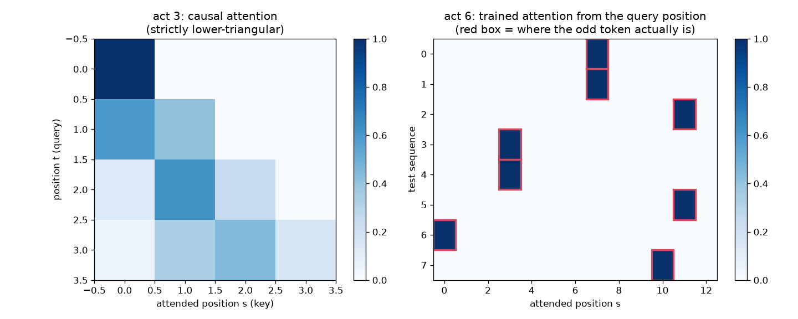

# Part 4 — Attention: The Heart of the Transformer

> **Goal of this chapter.** Derive the attention mechanism from first
> principles — not present the formula and decode it, but *arrive* at the
> formula by solving the routing problem from Part 2 (Shift 3) step by
> step. Then: masking, multi-head, and a clear taxonomy of the different
> **types of attention**. By the end, the famous equation
> `Attention(Q,K,V) = softmax(QKᵀ/√dₖ)V` should read like a sentence, and
> you will have computed it by hand and in code.

---

## 4.1 The problem, restated as an engineering spec

Each token arrives at an attention layer carrying a vector (its row of the
residual stream). The layer's job, for every position `t`:

1. Look at the vectors of other positions.
2. Decide *how relevant* each one is to `t` — based on **content**, decided
   at **runtime** (Part 2, Exercise 2.4: "it" must find *cat* in one
   sentence, *mat* in another).
3. Gather a summary of the relevant ones and hand it to position `t`.

And the whole thing must be **differentiable** (else backprop can't train
it) and **parallelizable** (the entire reason we fired the RNN).

## 4.2 First principles: a soft, differentiable lookup

Requirement 2 sounds like a **dictionary lookup**: "position `t` has a
question; find the entries that match it". A hard lookup (pick the single
best match) is not differentiable — `argmax` has no useful gradient. The
differentiable version of "pick one" is "**take a weighted average, with
weights that sum to 1 and concentrate on the best matches**". We already own
the tool that turns arbitrary scores into such weights: **softmax** (Part 1,
§1.5).

So the design pattern, in full generality:

```
for each position t:
    scores[t, s]  = how well does s's content match what t is looking for?   (a number, ∀s)
    weights[t, :] = softmax(scores[t, :])                                     (sums to 1)
    output[t]     = Σ_s weights[t, s] · (something from position s)           (weighted average)
```

Every attention variant ever proposed is this pattern with different
choices for "how to score" and "what to average". Now we make the choices.

## 4.3 Queries, keys, values

Naive choice: score by dot product of the raw token vectors,
`scores[t,s] = x_t · x_s`, and average the raw vectors. This works poorly,
for a reason worth understanding — **a token plays three different roles,
and one vector can't optimize for all three**:

- the role of *asker*: "as the word `it`, I am looking for a recent noun" —
- the role of *matcher*: "as the word `cat`, I am a noun, animate, singular" —
- the role of *messenger*: "if you pick me, here is the information I will
  actually deliver to you" (which may differ from what made me matchable).

So we give each token three *projections* of its vector, one per role,
produced by — of course — learned linear layers, the only trainable thing
here:

```
q_t = W_Q x_t      # query : what t is looking for            shape (d_k,)
k_s = W_K x_s      # key   : what s advertises                shape (d_k,)
v_s = W_V x_s      # value : what s delivers if selected      shape (d_v,)
```

The dictionary metaphor becomes exact: **keys** advertise, a **query**
probes, **values** get returned — except softly, everything fractionally.
Score = dot product `q_t · k_s` (large when the query direction aligns with
the key direction). The three matrices `W_Q, W_K, W_V` are ordinary weight
matrices, shared across all positions (Shift 2), trained by backprop from
the same next-token loss as everything else. *What* "relevant" means is
therefore itself **learned**, not designed.

## 4.4 Assembling the formula

Stack the per-position vectors into matrices (shapes on the right; `T`
tokens, model dim `d`, head dim `d_k`):

```
X : (T, d)                      the residual stream
Q = X W_Qᵀ : (T, d_k)           all queries at once
K = X W_Kᵀ : (T, d_k)           all keys
V = X W_Vᵀ : (T, d_v)           all values

S = Q Kᵀ / √d_k : (T, T)        all T×T scores in ONE matrix multiply
A = softmax(S, per row) : (T, T)     each row: a probability distribution
Out = A V : (T, d_v)            each row: weighted average of values
```

That is the celebrated equation, and note what fell out of writing it in
matrix form: **all positions compute their lookups simultaneously** — three
matmuls and a softmax, perfectly parallel, GPU heaven. Requirement
"parallelizable": met. The `(T, T)` matrix `A` is the runtime-computed
wiring diagram promised in Part 2: entry `A[t, s]` = fraction of attention
position `t` pays to position `s`. It is *data*, recomputed for every input
— not parameters.

**Why the `√d_k`?** The one non-obvious constant. A dot product of two
random `d_k`-dim vectors has standard deviation ~`√d_k`; with `d_k = 64`
raw scores would be large, and softmax of large scores **saturates** — one
weight ≈ 1, rest ≈ 0, gradients ≈ 0 (same pathology as Exercise 1.2's
plateau). Dividing by `√d_k` normalizes score variance to ~1, keeping
softmax in its trainable regime. That's all: a variance-hygiene constant.
(This is why it's called **scaled** dot-product attention.)

**Cost.** `S` is `T × T`: attention compares every pair. Doubling context
length quadruples compute and memory for `S` — the famous **O(T²)
bottleneck** driving a decade of research (§4.7).

## 4.5 Causal masking — attention with the future blindfolded

A decoder-only model is trained to predict the next token *at every
position simultaneously* (this is what makes training efficient — Part 5).
Position 3's output tries to predict token 4. If attention let position 3
read position 4's content, the prediction task collapses into copying — the
answer is sitting in plain sight. **Each position may attend only to itself
and the past.**

Implementation is almost cheeky. Before the softmax, overwrite every
"future" score with `-∞`:

```
S[t, s] = -inf   for all s > t        # upper triangle of the T×T matrix
```

`softmax` exponentiates: `e^{-∞} = 0` — future positions get exactly zero
weight, and each row automatically renormalizes over the allowed (past)
positions. In code it's one line, `scores.masked_fill(mask == 0, -inf)`,
with `mask = torch.tril(torch.ones(T, T))` (lower-triangular of ones).
The attention matrix `A` becomes lower-triangular:



Why `-∞` *before* softmax rather than zeroing weights after? Zeroing after
would break the sum-to-1 property (rows would need renormalizing — which is
exactly what softmax-after-masking does for free) and, worse, still leak
information through the pre-normalized values. Mask the *scores*, and the
future is mathematically unreachable — during training *and* generation.

Note what masking is **not**: it is not learned, and it is not about
padding (that's a different mask that hides `<pad>` filler tokens in
batched variable-length data — same `-∞` trick, different reason).

## 4.6 Multi-head attention — several conversations at once

One attention computes *one* pattern of relatedness per layer — one `(T,T)`
matrix. But "it→cat" (coreference), "was→cat" (agreement), "sat→on" (verb
frame) are *different* relations, wanted *simultaneously*. One weighted
average would blur them: attention weights sum to 1, so attending more to
one relation means attending less to another.

Fix: run `h` **independent, smaller** attentions in parallel — called
**heads** — each with its own `W_Q, W_K, W_V`, each in its own subspace,
then concatenate the results and mix with one more linear layer:

```
head_i = Attention(X W_Q⁽ⁱ⁾ᵀ, X W_K⁽ⁱ⁾ᵀ, X W_V⁽ⁱ⁾ᵀ)      i = 1..h, each (T, d/h)
MultiHead(X) = concat(head_1, ..., head_h) W_Oᵀ            (T, d)
```

The standard economy trick: shrink each head to `d_k = d/h` dimensions
(GPT-2: `d = 768`, `h = 12` heads, `d_k = 64`), so total compute ≈ one
full-width attention. In implementations the `h` heads are not a loop but
one tensor of shape `(B, h, T, d_k)` — a `reshape`+`transpose` of a single
big projection. You'll see both a readable loop version and the reshape
version in the code.

The output projection `W_O` matters: it lets the block *combine* what the
heads found before writing back to the residual stream.

Do heads really specialize? Often, interpretably so — in real GPT-2 you can
find a "previous token" head, heads tracking syntactic dependencies, heads
that attend to the delimiter as a "no-op". (You will look at real ones in
Part 6.) But don't over-romanticize: many heads are redundant or unclear;
specialization is a tendency, not a design guarantee.

## 4.7 The types of attention, organized

The phrase "types of attention" mixes three independent axes plus an
implementation axis. Untangled:

**Axis 1 — Where do Q and K/V come from?**

| Type | Q from | K, V from | Used in |
|---|---|---|---|
| **Self-attention** | the sequence | the *same* sequence | GPT, BERT — every model in this guide |
| **Cross-attention** | decoder sequence | *another* sequence (encoder output) | translation models, image-conditioned decoders, Whisper |

Cross-attention is the original 2014 use (decoder consults source
sentence). **Decoder-only models have no cross-attention** — deleting it is
what turns the 2017 decoder block into the GPT block.

**Axis 2 — Who may look at whom? (the mask)**

| Type | Mask | Consequence | Used in |
|---|---|---|---|
| **Bidirectional (full)** | none | every token sees all tokens | BERT-style encoders |
| **Causal (masked, autoregressive)** | lower-triangular | tokens see only the past | GPT — our focus |

Encoders can use full attention because their job is *understanding* given
whole texts; decoders must be causal because their job is *generating*
text they haven't written yet.

**Axis 3 — How many K/V sets do the heads share?** (a modern, purely
economic axis — the KV-cache at generation time, Part 5, costs memory
proportional to the number of K/V heads)

| Type | K/V heads | Trade-off |
|---|---|---|
| **MHA** — multi-head (GPT-2, this guide) | one per Q head | max quality, max cache |
| **MQA** — multi-query (PaLM) | one, shared by all | tiny cache, some quality loss |
| **GQA** — grouped-query (Llama-2/3, Mistral) | one per *group* of Q heads | the modern compromise |

**Axis 4 — Exact vs approximate/restricted** (attacks on O(T²); recognize
the names): **sliding-window/local** attention (each token sees the last
`w` tokens — Mistral, Gemma), **sparse/strided** patterns (GPT-3 used
alternating local+global layers), linear-attention approximations
(Performer, Mamba-adjacent). And **FlashAttention** (Dao et al., 2022),
which is *not* a new type — it computes exact standard attention with a
tiling strategy that never materializes the `(T,T)` matrix in slow GPU
memory. `F.scaled_dot_product_attention` in PyTorch routes to it
automatically.

*GPT-2, our study object: multi-head causal self-attention, exact, MHA.*
Now you can parse that phrase word by word.

> **Historical note.** **2014** — Bahdanau, Cho & Bengio bolt a small
> scoring network onto an RNN translator so the decoder can look back at
> source words: attention as *patch*. **2015** — Luong et al. simplify the
> scoring to a dot product (the version that survived). **2017** — Vaswani
> et al.'s *Attention Is All You Need* deletes the RNN: attention promoted
> from patch to load-bearing structure; scaled dot-product + multi-head are
> both from this paper. The title was a provocation that turned out to be
> a prophecy. **2019+** — the O(T²) arms race (sparse, sliding, linear);
> **2022** — FlashAttention makes exact attention fast enough that many
> approximations became unnecessary. Contexts grew from 512 (2017) to
> millions (2024+).

## 4.8 The code — `code/05_attention_step_by_step.py`

The script is the chapter in executable form, six numbered acts, every
tensor's shape printed:

1. **By hand:** `T=4, d=8` — random `X`, project `Q,K,V`, print the raw
   score matrix, the scaled one, softmaxed rows summing to 1, the output.
2. **Saturation demo:** the same scores *without* `/√d_k` at `d_k = 512` —
   watch softmax collapse to one-hot (why scaling exists).
3. **Causal mask:** apply `tril`, print the `-inf` score matrix and the
   lower-triangular `A`; verify row `t` ignores columns `> t`.
4. **The permutation test:** shuffle input rows → outputs shuffle
   identically (Part 3, §3.5, proven by experiment).
5. **Multi-head:** the readable loop version, then the
   `reshape/transpose` production version, asserting they agree.
6. **One trained-attention picture:** a single attention head trained on a
   toy "find the odd token out" task (report *where* it sits), plotting the
   learned attention pattern (`diagrams/attention-heatmap.png`) — attention
   that *learned* to look at the right place, with ~1.0 weight on it.

Read it with a pencil; it is written to be read as much as run.

## 4.9 Exercises

**4.1 (paper, do not skip)** With `T=2, d_k=2`: `x₁=(1,0), x₂=(0,1)`,
`W_Q = W_K = I`, `W_V = I`. Compute by hand: scores, scaled scores, softmax
weights, outputs. Now set `W_K = [[0,1],[1,0]]` (swap rows) and redo —
watch "who attends to whom" invert while the tokens themselves never
changed. *This is the entire mechanism in one arithmetic exercise: the
learned `W`s define what similarity means.*

**4.2** In the script's act 3, remove the mask but keep training the act-6
toy task on *next-token* prediction. Loss falls to ~0 suspiciously fast.
Explain the "cheat". (This is the most instructive bug in all of deep
learning — everyone ships it once. Better here than in production.)

**4.3** Softmax rows of `A` sum to 1. Suppose *nothing* in the past is
relevant to token `t` — what does attention deliver anyway, and why might
that be a problem? Look up "attention sink" / why GPT-2 heads often dump
weight on the first token, and relate it to this constraint.

**4.4** Compute the exact parameter count of one GPT-2 attention block
(`d=768, h=12`, biases included): `W_Q, W_K, W_V, W_O` — verify against
Part 6's checkpoint dump. Then compute the *activation* memory of `A` alone
at `T = 1024` and at `T = 32768` (float32). Which grows with the model, and
which with the input?

**4.5** Modify act 5 to implement **MQA**: all heads share one `W_K, W_V`.
Count parameters saved and re-run the toy task. Then generalize to **GQA**
with 2 groups. You have now implemented rows 2 and 3 of the Axis-3 table.

**4.6 (stretch)** Implement sliding-window attention (mask allows only the
last `w=2` positions). What information can *never* reach position `T-1` in
one layer? How many stacked layers until the first token can influence the
last, at window `w`? (This "receptive field" logic is exactly CNNs'.)

→ [Part 5 — The decoder-only transformer, block by block](part-5-decoder-only-transformer.md)
