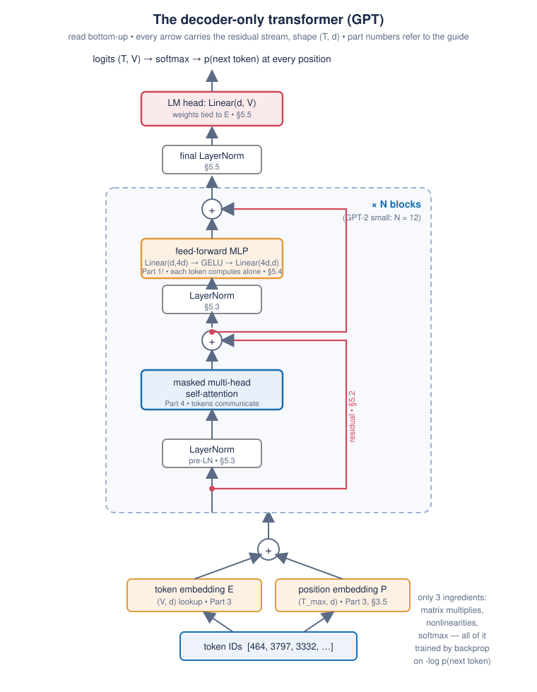

# Part 5 — The Decoder-Only Transformer, Block by Block

> **Goal of this chapter.** Assemble everything: take embeddings (Part 3)
> and masked multi-head self-attention (Part 4), add the three remaining
> ingredients — **residual connections, layer normalization, and the
> feed-forward block** — and obtain the complete GPT architecture. Then
> train one, for real, in `code/06_mini_gpt.py`, and understand generation
> (sampling, temperature, KV cache). After this chapter the architecture
> diagram contains zero unexplained boxes.

---

## 5.1 The map



```
token IDs (T,)
  → token embedding + position embedding        (T, d)      Part 3
  → Block × N:                                               this chapter
        x = x + MHA(LayerNorm(x))               (T, d)      "communicate"
        x = x + MLP(LayerNorm(x))               (T, d)      "compute"
  → final LayerNorm                              (T, d)
  → LM head: Linear(d, V)                        (T, V)      logits
  → softmax → next-token distribution at every position
```

GPT-2 small: `N = 12` blocks, `d = 768`, `h = 12` heads, `V = 50257`,
context `T_max = 1024` → 124M parameters. The *entire* forward pass is the
five lines above. Let's earn the parts you haven't met.

## 5.2 Residual connections — the highway

Notice the block computes `x + MHA(...)`, not `MHA(...)`. That `x +` is a
**residual (skip) connection**, and it is arguably the most consequential
"small" idea in deep learning (He et al. 2015, ResNet — for image nets;
transformers inherited it).

**The problem it solves.** Backprop multiplies local derivatives along the
path from loss to parameter (§1.7). Through 12+ blocks — each a stack of
matmuls, softmaxes, nonlinearities — those products tend to shrink toward 0
(or blow up): the **vanishing/exploding gradient** problem. Early layers of
a deep plain network learn glacially because almost no gradient survives
the trip back.

**The fix.** `out = x + f(x)` has derivative `∂out/∂x = I + ∂f/∂x` — that
`I` (identity) is a gradient *expressway*: no matter what `f` does, at
least 100% of the incoming gradient flows straight through the `+`,
un-multiplied, all the way from the loss to the embeddings. Deep networks
became trainable the day this shipped.

**The better mental model — the residual stream.** Rather than "layer after
layer transforming x", picture a **conveyor belt of width `(T, d)`
carrying each token's state from embedding to output**. Blocks are stations
along the belt that *read* from it, compute something, and **add** their
contribution back onto it. Nothing is ever overwritten — attention adds a
message-passing update, the MLP adds a computation update, layer by layer
refining each token's vector. (This "residual stream" view is the working
language of modern interpretability research, and it makes Part 6's
weight-dissection natural.)

## 5.3 LayerNorm — keeping activations in a healthy range

**The problem.** Sums of sums drift: after many `x + f(x)` stations the
scale of activations can wander, and downstream softmaxes/nonlinearities
saturate (the recurring villain of this course — see §1.2's flat sigmoid
tails, §4.4's √d_k).

**The fix.** Before each sub-block, re-standardize every token's vector:
**LayerNorm** (Ba, Kiros & Hinton, 2016) takes one `d`-dim vector,
subtracts its mean, divides by its standard deviation — computed **across
the `d` features of that single token**, no batch involved, no statistics
carried between train and test — then applies a learned per-feature scale
`γ` and shift `β` (2·d parameters, so the network can undo the
normalization where it helps):

```
LN(x) = γ ⊙ (x − mean(x)) / std(x) + β        per token, x ∈ ℝᵈ
```

**Pre-LN vs Post-LN** (a real gotcha reading papers): the 2017 paper put LN
*after* the residual add ("post-LN"); GPT-2 moved it *before* each
sub-block ("pre-LN": `x + f(LN(x))`), which keeps the residual expressway
completely clean and trains far more stably — pre-LN is why GPT-2-scale
models train without fragile warm-up schedules. Everything modern is
pre-LN (or a variant like RMSNorm — same idea, drops the mean-centering).
Our code is pre-LN, like GPT-2.

## 5.4 The feed-forward block — the MLP you already know

The second station in each block is, verbatim, Part 1:

```
MLP(x) = W₂ · GELU(W₁ x + b₁) + b₂       W₁: d → 4d,   W₂: 4d → d
```

- Applied **independently to each token's vector** (Shift 2 — one set of
  weights, every position). No token-to-token interaction here; that is
  attention's job. Communication (attention) then computation (MLP).
- The hidden width is `4d` — expand to 3072 dims (for GPT-2), nonlinearity,
  project back. The `4×` is convention from the 2017 paper; nobody claims
  it's optimal, everybody keeps it roughly there.
- **GELU** instead of ReLU: a smooth ReLU (`x · Φ(x)`, Gaussian CDF —
  gates *by magnitude probabilistically* instead of hard-zeroing).
  Empirically slightly better; conceptually, still "the nonlinearity".
- Parameter accounting worth internalizing: per block, the MLP holds
  `2 × 4d² ≈ 4.7M` parameters vs attention's `4d² ≈ 2.4M` — **two-thirds of
  a transformer's compute-layer parameters live in the plain old MLPs.**
  Current understanding (worth holding loosely): attention *routes*
  information; the MLPs *store and apply* most of the model's factual/
  associative knowledge. The exotic part of the transformer is smaller than
  the diagram makes it look.

## 5.5 The output end: final LN, LM head, weight tying

After block `N`: one last LayerNorm, then the **language-model head** — a
single `Linear(d, V)`, no softmax inside the model (the loss applies
log-softmax itself, numerically fused): it converts each token's final
768-dim vector into `V = 50257` **logits** = scores for "which token comes
next after me".

**Weight tying** (Press & Wolf 2016; used by GPT-2): the LM head's `(V, d)`
matrix is *the same tensor* as the token-embedding table `E`. Rationale:
both matrices relate "token identity ↔ meaning vector", just in opposite
directions (embedding: ID → vector; head: vector → score per ID — a dot
product with each row of `E`, i.e. "which token's embedding does my final
state point toward?"). Saves 38M parameters (31% of GPT-2!) and slightly
helps quality. Also the final answer to Part 3's question "how do
embeddings learn": in a tied model, `E` receives gradient **both** as the
first layer and as the last.

## 5.6 Training: every position is a training example

Now the piece that makes decoder-only models so scalable. Take a chunk of
text of `T+1` tokens. Feed tokens `0..T−1` in; ask the model, **at every
position simultaneously**, to predict the *next* token:

```
input : [The, cat, sat, on, the]
target: [cat, sat, on, the, mat]        # the same text, shifted one left
loss  = mean over positions of cross_entropy(logits[t], target[t])
```

- **One forward pass = `T` training examples.** The causal mask (§4.5) is
  what makes this legitimate — position `t`'s prediction provably cannot
  peek at `t+1`. This is why the mask exists; efficiency, not ideology.
- **The labels are free.** Any text supervises itself — no annotation, no
  paired data. This is why decoder-only won the scale race (Part 2, §2.5):
  the training set is "everything ever written".
- The loss is `-log p(correct next token)` — **your digit classifier's
  loss** (§1.5), `V`-way instead of 10-way. Perplexity, the standard LM
  metric, is just `e^loss`: "the model is as confused as if choosing
  uniformly among ⟨perplexity⟩ options".

And the optimizer is Adam, and gradients come from `loss.backward()`, and
the training loop is the same five lines from §1.8. **Nothing about
*training* changed since XOR — only the architecture between input and
loss.** That is the deepest sense in which a transformer "is just a neural
network".

## 5.7 Generation: the autoregressive loop

Training predicts everywhere at once; **generation** runs one token at a
time, feeding each choice back in — *autoregressive* decoding:

```
context = prompt tokens
repeat:
    logits  = model(context)[-1]          # only the LAST position's prediction
    next_id = sample from softmax(logits)
    context = context ⧺ next_id
```

How you "sample" is a knob with real personality effects:

- **Greedy** — always argmax. Deterministic, but dull and loop-prone
  ("the the the…" pathologies).
- **Temperature `τ`** — divide logits by `τ` before softmax. `τ→0`: greedy;
  `τ=1`: the model's honest distribution; `τ>1`: flatter, riskier. (Same
  softmax-sharpness mathematics as §4.4's √d_k — third appearance of this
  motif.)
- **Top-k / top-p** — sample only among the k most likely tokens (GPT-2's
  release used top-k=40), or the smallest set with cumulative probability p
  (nucleus sampling). Cuts off the long tail of individually-unlikely
  tokens that collectively derail generations.

**The KV cache** (the optimization every inference stack lives on): naively,
step `t` re-runs the whole model on all `t` tokens — O(T²) *per step*,
O(T³) per sequence. But with a causal mask, positions `0..t−1`'s keys and
values *cannot change* when token `t` arrives (nothing attends forward).
So: cache every layer's K and V; each new step computes Q/K/V **only for
the newest token**, attends against the cached K/V, appends its own. This
is also why Axis 3 of §4.7 (MQA/GQA) exists: at long contexts the cache,
not the weights, dominates GPU memory. `06_mini_gpt.py` implements
generation the simple way; implementing the cache is Exercise 5.6.

## 5.8 The code — `code/06_mini_gpt.py`

The chapter's centerpiece: a **complete, trainable GPT in ~200 readable
lines** — every line of the architecture written out (`nn.Embedding`,
manual attention, pre-LN blocks, weight tying; no `nn.Transformer`
black box). Character-level tokenizer (vocab = the distinct characters of
the corpus — dodges BPE so the model itself stays the whole story), trained
on a bundled public-domain text.

Defaults are laptop-CPU-sized (4 layers, 4 heads, d=128, T=64; ~0.8M
params, ~10 minutes). It prints generated samples every few hundred steps —
**watch the function approximator converge on English**: random bytes →
letter frequencies → word-shaped strings → words → phrases with grammar.
That progression, live, teaches more about what "language modeling" means
than any paragraph. A `--colab` flag scales it up if you run the notebook
version on a GPU (bigger model, more steps, visibly better text).

Also in the script: a `--speak` flag that prints the loss as perplexity, so
you can narrate training as "confusion among N choices" (starts near vocab
size — uniform — and falls).

## 5.9 GPT-2 concretely (bridge to Part 6)

| | layers N | d | heads | params |
|---|---|---|---|---|
| mini-GPT (ours) | 4 | 128 | 4 | ~0.8M |
| GPT-2 small | 12 | 768 | 12 | 124M |
| GPT-2 XL | 48 | 1600 | 25 | 1.5B |
| GPT-3 | 96 | 12288 | 96 | 175B |

Read the table vertically: **the architecture is identical down the
column** — same block, same mask, same loss. The differences are three
integers (and data, and patience). What you trained in §5.8 differs from
GPT-3 by hyperparameters, not by kind.

> **Historical note.** **GPT-1** (Radford et al., 2018, 117M): the bet that
> generative pre-training on unlabeled text + light fine-tuning beats
> task-specific architectures. **GPT-2** (2019, up to 1.5B): "Language
> Models are Unsupervised Multitask Learners" — sheer next-token prediction
> yields translation, summarization, QA *without* fine-tuning; famously
> released in stages over misuse concerns (quaint in hindsight — and why
> the 124M "small" is the openly-available workhorse we dissect in Part 6).
> **GPT-3** (2020, 175B): in-context learning — the model learns tasks from
> examples *in the prompt*, no weight updates. **2022**: RLHF/instruction
> tuning turns raw next-token predictors into assistants (ChatGPT) — a
> *training-objective* innovation; the architecture underneath remains the
> one you just built. Karpathy's **nanoGPT** (2022) — the spiritual parent
> of `06_mini_gpt.py` — reproduces GPT-2 in ~300 lines; after this chapter
> you can read every line of it.

## 5.10 Exercises

**5.1** Delete the two residual connections in `Block.forward` (use
`x = self.attn(self.ln1(x))` etc.) and retrain at N=4, then N=8 layers.
Compare loss curves with the original. You are reproducing, at toy scale,
the discovery of §5.2.

**5.2** Print the loss at step 0, before any training. Predict it first:
with vocab size 65, what is `-log(1/65)`? Why *must* an untrained model
start there? (If it starts much higher, your initialization is biased —
a real debugging heuristic used on real models.)

**5.3** Generate 300 characters at temperatures 0.2, 0.8, 1.0, 1.5 from the
same trained checkpoint and the same prompt. Characterize each regime in
one sentence. Find the τ where it stops being "boring" and starts being
"drunk".

**5.4** Verify weight tying empirically: check
`model.lm_head.weight is model.tok_emb.weight` (identity, not equality),
then untie them (independent `Linear`) and retrain. Compare parameter
counts and final loss. At this scale untied may win slightly — why might
tying matter more when `V·d` is 38M than when it is 8K?

**5.5** The context is T=64. Feed a 200-character prompt to `generate()`
and explain what the code does about it (look for the crop). What would the
*position table* do if you didn't crop? (This is Part 3 §3.5's `T_max`
limitation, now concrete.)

**5.6 (stretch, the classic)** Implement the KV cache in `generate()`:
each block stores K,V per step; each step feeds only the newest token.
Assert identical outputs to the naive version (greedy decoding), then time
both generating 500 tokens. The speedup you measure is why inference
providers exist.

**5.7 (paper)** GPT-2 small parameter audit, closing Exercise 3.3 and 4.4:
embeddings (tied) + positions + 12 × (attention + MLP + 2 LN) + final LN.
Get within 1% of 124M. Every number in that audit is now a concept you own.

→ [Part 6 — GPT-2 in practice](part-6-gpt2-in-practice.md)
