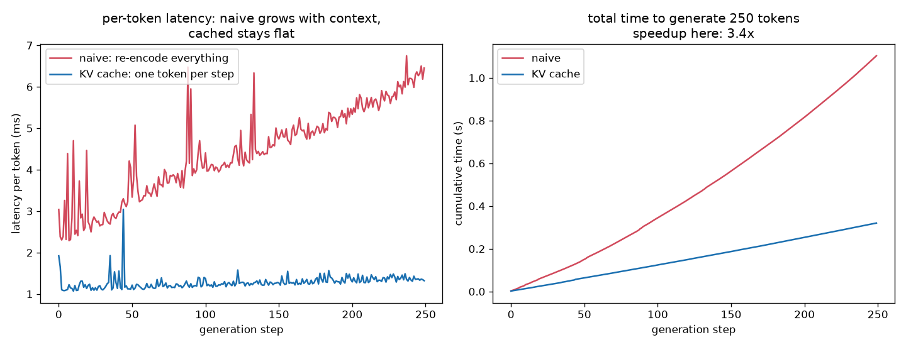

# Part 8 — The KV Cache: Why Inference Doesn't Cost O(T³)

> **Goal of this chapter.** Exercise 5.6 asked you to implement the KV
> cache; this chapter is the full walkthrough — the waste in naive
> generation, the *invariance argument* that makes caching mathematically
> exact (not an approximation!), a working implementation with a
> token-for-token equivalence proof and a benchmark
> (`code/09_kv_cache.py`), and the memory arithmetic that quietly dictates
> the design of every modern serving stack. This is also where Part 4's
> "Axis 3" (MQA/GQA) stops being trivia and becomes obviously necessary.

---

## 8.1 The waste, quantified

Recall generation (§5.7): to produce each new token, feed the whole
context through the model, take the **last position's** logits, sample,
append, repeat.

Watch what the naive loop actually computes. Generating token #101 with a
100-token context runs the full forward pass on 100 positions — but we
*only read row 100* of the output. What were the other 99 rows? The
predictions for tokens we already have. And here is the crime: **we
computed those exact 99 rows in the previous step too.** And the step
before. Every step redoes, verbatim, almost everything the previous step
did, then throws it away.

Cost of the naive loop: step `t` costs O(t·d²) for the matmuls (+ O(t²·d)
attention), so generating T tokens costs **O(T²·d²)** — per-token latency
grows linearly with context, total time quadratically. You will *see*
these curves in the benchmark plot.

## 8.2 The invariance argument (first principles)

Can we reuse last step's work? Only if it provably hasn't changed. Trace
what position `s` contributes when the model processes position `t > s`:

1. Position `s`'s vector at every layer is computed from tokens `0..s`
   only — **the causal mask guarantees nothing after `s` ever flows into
   it** (§4.5). Appending token `t` cannot alter anything at position `s`,
   in any layer. Its keys `k_s` and values `v_s` are frozen facts.
2. What does the *new* position `t` actually need from the past? Walk the
   attention formula: `q_t` (from the new token), then `q_t·k_s` for all
   `s`, then a weighted sum of `v_s`. **Only k and v.** Not the past
   queries (each `q_s` was consumed at step `s`, computing row `s` — the
   row we throw away), not the past MLP activations (the MLP is per-token,
   §5.4 — position `t` runs its own), not the past residual streams.

So the recipe writes itself:

> **After each step, keep every layer's `k` and `v` for all positions (the
> KV cache). Each new step feeds ONLY the newest token: compute its
> q, k, v, attend against the cached K/V, append its own k, v to the
> cache.** Per-token cost drops from "re-encode everything" to "encode one
> token" — O(d²) matmuls plus O(t·d) attention reads.

Two things worth saying explicitly:

- **This is exact, not an approximation.** It's the same computation with
  the redundant parts skipped — the script *asserts* bitwise-identical
  greedy outputs. The cache is pure bookkeeping, licensed by causality.
  (This is also the answer to a natural worry from Part 2: yes, the
  transformer is "stateless" per forward pass, but at inference we
  *manufacture* recurrence-like state out of its causal structure. The KV
  cache is the transformer's answer to the RNN's hidden state — except
  it's lossless, because it keeps everything instead of squeezing history
  into one vector.)
- **Why it exists for decoders only:** a bidirectional encoder (BERT)
  lets position `s` see position `t > s`, so old representations *do*
  change when tokens arrive — nothing is invariant, nothing can be cached.
  Causal masking, which looked like a training-time trick in §4.5, turns
  out to be what makes cheap generation possible at all.

## 8.3 Prefill vs decode — the two phases of inference

The cached loop splits generation into two very different regimes, and
this split is *the* organizing fact of inference engineering:

- **Prefill** — the prompt is encoded in ONE parallel forward pass (all
  prompt tokens at once, like training), populating the cache. Big
  matmuls, compute-bound, GPUs love it. (Our benchmark prompt is only 6
  tokens, so its prefill barely registers — exercise 8.3 has you measure a
  real one.)
- **Decode** — one token per step, forever after. Tiny matmuls (a single
  position!) but the *whole cache must be read* every step:
  **memory-bandwidth-bound**. The GPU spends its time streaming K/V bytes,
  not multiplying.

This is why "time-to-first-token" and "tokens-per-second" are quoted
separately for LLM APIs — they are the two phases, with different
bottlenecks. And it reframes the batching economics: during decode, the
weights are read once per step *regardless of batch size*, so serving many
sequences at once is nearly free compute-wise — until the KV caches fill
the memory. Which brings us to the arithmetic.

## 8.4 The memory bill

Cache size per sequence = `n_layer × 2 × T × d_kv × bytes` (the 2 is k
and v; `d_kv` = heads × head-dim that store K/V):

| model | context | cache per sequence |
|---|---|---|
| our toy (4 layers, d=128) | 256 | ~1 MB |
| GPT-2 small (12 × 768) | 1,024 | 75 MB (fp32) |
| 70B-class dense model, **MHA**, fp16 | 32,768 | ~86 GB — untenable (batch 1 fills two GPUs) |
| same model with **GQA** (8 KV heads) | 32,768 | ~11 GB — shippable |

Read the last two rows together and Part 4's Axis 3 completes itself:
**MQA/GQA were never about model quality — they exist to shrink this
table.** Fewer K/V heads = a proportionally smaller cache = more
concurrent users per GPU. The cache, not the weights, is what fills
serving memory at long context (weights are constant; caches scale with
`batch × context`).

The second-order problem is *fragmentation*: caches grow token by token
and die when a request completes, so naively pre-allocating
max-context-sized slabs wastes most of the memory. **PagedAttention**
(vLLM, 2023) manages cache memory in small non-contiguous pages — i.e.,
someone re-invented virtual memory for attention — and roughly one epoch
of serving-throughput gains came from just that. Other levers, all
attacking the same bill: cache quantization (fp8/int8 K/V), sliding-window
attention (cap the cache at `w` positions — §4.7 Axis 4), and prefix
sharing (many requests with the same system prompt share one prefill'd
cache).

> **Historical note.** The trick is as old as autoregressive transformers
> — the original GPT-2 codebase (2019) already threads a `past` tensor
> through its TF graph, and Hugging Face's `past_key_values` (the same
> `(k, v)` tuples our script returns) has carried it ever since; it was
> considered too obvious to publish. It *became a research area* when
> contexts exploded (512 → 128k tokens, 2019→2024) and the cache overtook
> the weights as the scarce resource: MQA (Shazeer 2019, tellingly titled
> *"One Write-Head is All You Need"*), GQA (2023), PagedAttention/vLLM
> (2023), and the fp8-cache/prefix-sharing toolbox of current engines.
> Today "how big is your KV cache" is effectively the question "how many
> users can you serve".

## 8.5 The code — `code/09_kv_cache.py`

Self-contained: it trains the Part-5 mini-GPT (context 256) for a few
minutes, then runs the actual walkthrough. The architecture change is
deliberately minimal — diff it against `06_mini_gpt.py`:

- every `forward` gains an optional `past` and returns a `present`:
  attention concatenates cached K/V before the newest token's
  (`k = cat(past_k, k_new)`);
- the causal mask becomes *cache-aware*: an arriving token at global
  position `P+i` may see keys `0..P+i` (`tril` with `diagonal=P`) — and
  during one-token decode no mask is needed at all, since the future
  literally hasn't been computed;
- positions matter: the new token must get `pos_emb[P]`, not
  `pos_emb[0]` — forget this and generation quietly degrades (a classic
  bug; exercise 8.2 makes you cause it on purpose).

Then the payoff, in order: **the proof** (`generate_naive` vs
`generate_cached`, greedy, `torch.equal` on the outputs — `True`), **the
benchmark** (measured here, CPU, 250 tokens: ~3× total, last-token latency
~4× — and still climbing, since naive latency grows with every token
while cached stays flat), and **the bill** (§8.4's table computed live).

Left: per-token latency — naive climbs linearly while cached stays flat.
(If your run shows a tall blue spike near the end, that is the cache
hitting `T_max` and falling back to a full re-encode — exactly the punt
exercise 8.4 asks you to fix; the plot annotates it when it stands out.)
Right: cumulative time — the quadratic-vs-linear separation.

## 8.6 Exercises

**8.1** Before running the benchmark, predict the shapes: with a 6-token
prompt and 100 generated tokens, what is `pasts[0][0].shape` at the end?
Verify. Now double `n_head` (keeping `d`): does the cache size change?
Why not — and *which* hyperparameter would you change to shrink it
(Axis 3!)?

**8.2 (the classic bug)** In `generate_cached`, replace the global
position with `torch.arange(t)` (i.e., give every new token position 0).
The equivalence assert fails — but *how* does the text degrade? Generate
100 tokens and describe it. You will recognize this failure mode instantly
if you ever cause it in real code.

**8.3** Measure the crossover: for prompt lengths 8, 64, 200, time
*prefill+1 token* vs naive single-step. Roughly where does cached
generation start winning, and why is a cache pointless for a
single-forward-pass task (classification with an LM, perplexity scoring)?

**8.4** Our script punts when the cache hits `T_max`: it falls back to a
full re-encode each step (find the comment). Implement a **sliding
cache**: drop the oldest entry and shift. What *else* must you handle for
the model not to degrade — think about what `pos_emb[P]` means when
absolute positions keep growing past `T_max`? (This pain is a big part of
why RoPE/relative positions won — §3.5.)

**8.5** Implement MQA in the cached model: one K/V head shared by all 4
query heads (`k,v` projections output `d_head` instead of `d`). Retrain,
re-run the benchmark, and report: cache size (÷4), quality (val loss),
speed. You have now personally traversed the whole chain: mask → cache →
memory bill → MQA.

**8.6 (paper, capstone)** An API quotes 0.5 s time-to-first-token and 50
tokens/s steady-state for a 2,000-token prompt. Using the two-phase model
of §8.3, estimate what fraction of a 500-token completion's total latency
is prefill. Now explain, in one paragraph a product manager would
understand, why "make the prompt shorter" and "make the completion
shorter" are *different* optimizations.

---

*Back to the [README](README.md) · Previous: [Part 7 — Fine-tuning](part-7-fine-tuning.md)*
